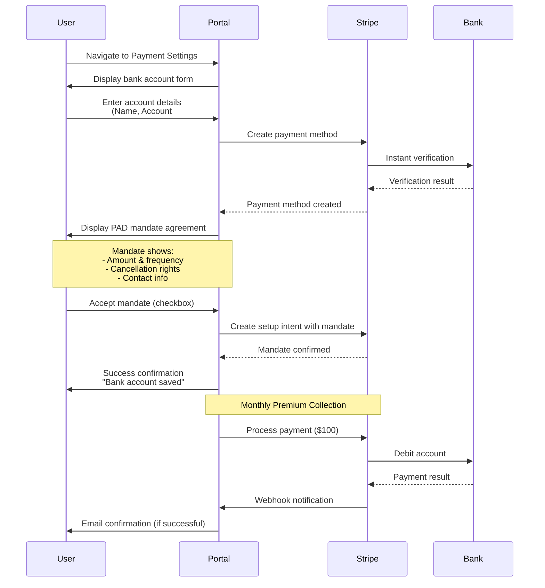
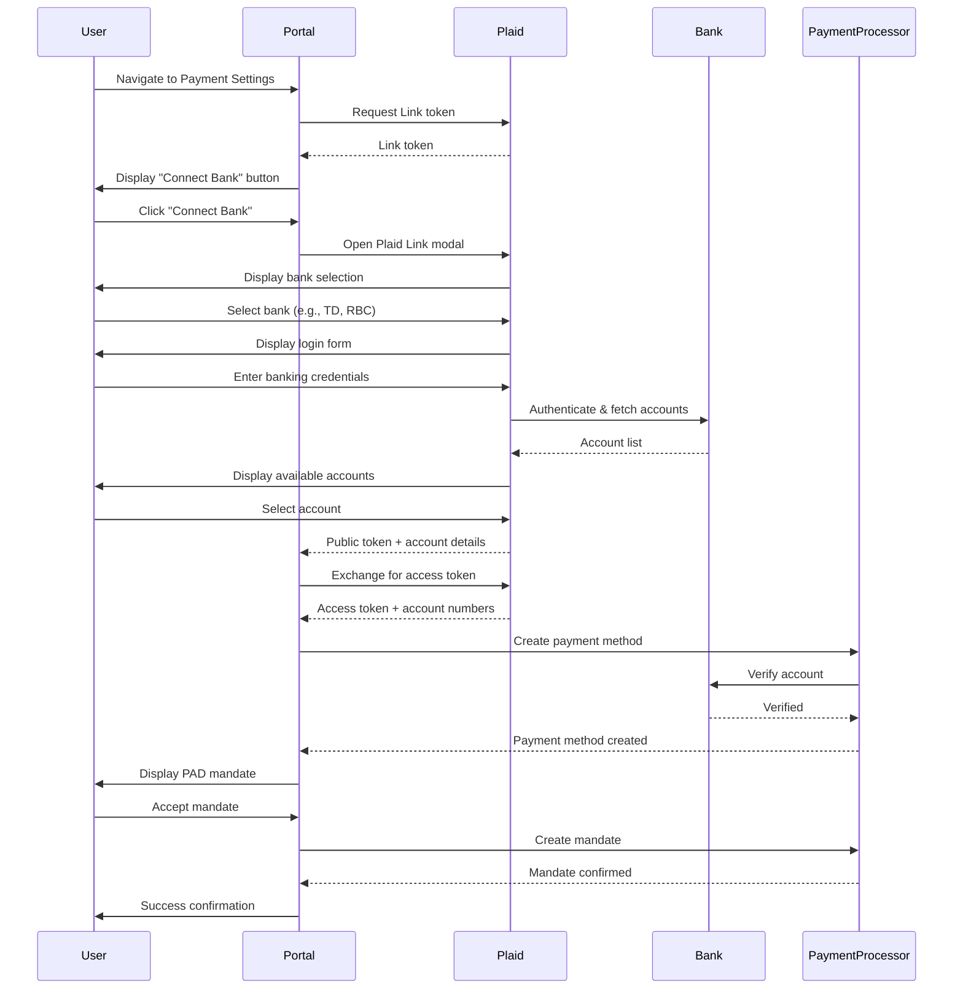
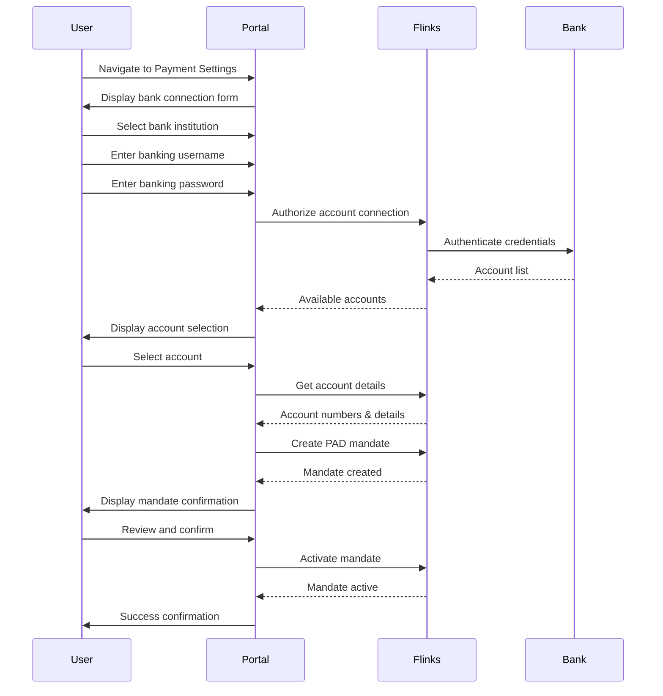

# Direct Debit Solutions for Canadian Insurance Premium Collection
## Business Decision Guide

### Executive Summary

This document provides a comprehensive analysis of direct debit solutions for capturing and validating bank accounts for recurring premium collection in Canada. The analysis compares three leading solutions based on compliance, cost, user experience, integration complexity, and operational efficiency.

---

## Table of Contents

1. [Canadian PAD Compliance Overview](#canadian-pad-compliance-overview)
2. [Solution Comparison Matrix](#solution-comparison-matrix)
3. [User Journey Flows](#user-journey-flows)
4. [Pricing Analysis & Comparison](#pricing-analysis--comparison)
5. [Detailed Solution Analysis](#detailed-solution-analysis)
6. [Questions & Negotiation Points](#questions--negotiation-points)
7. [Recommendation](#recommendation)
8. [Implementation Timeline & Considerations](#implementation-timeline--considerations)

---

## Canadian PAD Compliance Overview

### What is PAD?

**Pre-Authorized Debit (PAD)** is the standard method for recurring payments in Canada, governed by Payments Canada's PAD Rules. For insurance premium collection, PAD is the most cost-effective and reliable method.

**Reference**: [Payments Canada - PAD Rules](https://www.payments.ca/what-we-do/rule-making/pre-authorized-debit-pad-rules)

### Compliance Requirements

#### Mandatory Requirements:

1. **PAD Agreement (Mandate)**
   - **Required**: Yes, for all PAD transactions
   - **Format**: Written or electronic agreement signed by the customer
   - **Content Must Include**:
     - Customer's bank account information
     - Amount (fixed or variable)
     - Frequency of debits
     - Start date
     - Cancellation rights (customer can cancel anytime)
     - Contact information for disputes
   - **Storage**: Must be retained for 7 years

2. **Customer Authorization**
   - Customer must provide explicit consent
   - Can be obtained electronically (e-signature)
   - Must be clear and unambiguous

3. **Disclosure Requirements**
   - Advance notice of debit amount (if variable)
   - Advance notice of changes to terms
   - Clear cancellation process

4. **Dispute Handling**
   - Must provide customer service contact
   - Must handle unauthorized debit claims
   - Must comply with chargeback rules

### How to Obtain PAD Mandates

#### Option 1: Direct Financial Institution Partnership
- **Process**: Partner directly with a Canadian bank or credit union
- **Requirements**: 
  - Business registration
  - Financial institution approval
  - Compliance documentation
- **Timeline**: 3-6 months
- **Cost**: High setup fees, ongoing transaction fees
- **Complexity**: Very high

#### Option 2: Payment Service Provider (Recommended)
- **Process**: Use a third-party provider that handles PAD compliance
- **Requirements**: 
  - Business registration
  - Provider account setup
  - API integration
- **Timeline**: 2-4 weeks
- **Cost**: Lower setup, per-transaction fees
- **Complexity**: Low to moderate

**Recommendation**: Use a payment service provider for faster implementation and reduced compliance burden.

### PAD Mandate Sample

Below is an example of what a compliant PAD mandate should include:

**Screenshot Placeholder: PAD Mandate Template**
*[Screenshot should show: A sample PAD mandate form with fields for account holder name, bank account number, transit number (5-digit Canadian format), institution number (3-digit Canadian format), amount, frequency, start date, cancellation rights, and customer signature/acceptance checkbox]*

**Key Elements of a Compliant PAD Mandate (Canadian Requirements):**
1. Clear statement of authorization for pre-authorized debits
2. Bank account details:
   - **Account Number**: Customer's bank account number
   - **Transit Number**: 5-digit branch number (Canadian format)
   - **Institution Number**: 3-digit bank identifier (Canadian format)
   - Note: Canada uses transit + institution numbers, NOT routing numbers (US format)
3. Amount and frequency of debits
4. Start date
5. Customer cancellation rights (prominently displayed) - Customer can cancel anytime
6. Contact information for disputes (must be Canadian contact)
7. Customer acceptance (checkbox or signature)
8. Date and time of acceptance
9. IP address and user agent (for online acceptance)

**Reference**: [Canadian Bankers Association - PAD Agreement Guidelines](https://www.cba.ca/en/media-room/speeches-and-presentations/2018/pre-authorized-debit-pad-agreements)

---

## Solution Comparison Matrix

| Criteria | Stripe | Plaid | Flinks |
|----------|--------|-------|--------|
| **PAD Support** | ✅ Native ([Reference](https://stripe.com/docs/payments/ach-direct-debit)) | ⚠️ Via partner ([Reference](https://plaid.com/docs/link/canada/)) | ✅ Native ([Reference](https://flinks.com/products/payments/)) |
| **Bank Account Verification** | ✅ Instant | ✅ Instant | ✅ Instant |
| **Setup Time** | 1-2 weeks | 2-3 weeks | 2-3 weeks |
| **Integration Complexity** | Low | Low | Low |
| **Transaction Fees** | 0.8% + $0.30 ([Reference](https://stripe.com/ca/pricing)) | 0.5-0.8% + $0.25 ([Reference](https://plaid.com/pricing/)) | 0.6-0.9% + $0.30 ([Contact for pricing](https://flinks.com/contact/)) |
| **Monthly Minimum** | None | $500 | $500 |
| **Compliance Handling** | ✅ Automated | ✅ Automated | ✅ Automated |
| **User Friction** | Low | Low | Low |
| **Canadian Bank Coverage** | 95%+ ([Reference](https://stripe.com/docs/payments/ach-direct-debit)) | 90%+ ([Reference](https://plaid.com/docs/link/canada/)) | 99%+ ([Reference](https://flinks.com/products/account-verification/)) |
| **API Quality** | Excellent | Excellent | Good |
| **Documentation** | Excellent | Excellent | Good |
| **Support Quality** | Excellent | Good | Good |
| **Dispute Management** | ✅ Built-in | ✅ Built-in | ✅ Built-in |
| **Recurring Payment Management** | ✅ Native | ✅ Native | ✅ Native |
| **Webhook Support** | ✅ Yes | ✅ Yes | ✅ Yes |
| **PCI Compliance** | ✅ Handled | ✅ Handled | ✅ Handled |

---

## User Journey Flows

### Solution 1: Stripe User Journey

**Screenshot Placeholder: Stripe Bank Account Form**
*[Screenshot should show: Clean, simple form with fields for account holder name, account number, transit number (5-digit Canadian format), institution number (3-digit Canadian format), and account type selection (chequing/savings - Canadian terminology)]*

**Screenshot Placeholder: Stripe PAD Mandate Display**
*[Screenshot should show: Mandate agreement screen with clear terms, cancellation rights highlighted, and acceptance checkbox]*

**Key UX Features:**
- **Step 1**: Simple form with 4-5 fields
- **Step 2**: Instant verification (no waiting)
- **Step 3**: Clear mandate presentation
- **Total Time**: 2-3 minutes
- **Mobile Optimized**: Yes

---

### Solution 2: Plaid User Journey

**Screenshot Placeholder: Plaid Bank Selection Screen**
*[Screenshot should show: Plaid Link interface with searchable list of Canadian banks (TD, RBC, BMO, Scotiabank, CIBC, etc.) with bank logos]*

**Screenshot Placeholder: Plaid Account Selection**
*[Screenshot should show: List of user's bank accounts with account names, types, and last 4 digits, with "Select" buttons]*

**Key UX Features:**
- **Step 1**: Click "Connect Bank" button
- **Step 2**: Select bank from list
- **Step 3**: Login with banking credentials (OAuth-style)
- **Step 4**: Select account from list
- **Step 5**: Accept mandate
- **Total Time**: 3-4 minutes
- **Mobile Optimized**: Yes
- **No Manual Entry**: Account details auto-filled

---

### Solution 3: Flinks User Journey

**Screenshot Placeholder: Flinks Bank Institution Selection**
*[Screenshot should show: Dropdown or searchable list of Canadian financial institutions with logos]*

**Screenshot Placeholder: Flinks Account Connection Form**
*[Screenshot should show: Form with bank selection, username field, password field, and security messaging]*

**Screenshot Placeholder: Flinks Account Selection**
*[Screenshot should show: List of connected accounts with account names, balances, and account numbers masked]*

**Key UX Features:**
- **Step 1**: Select bank from dropdown
- **Step 2**: Enter banking credentials
- **Step 3**: Select account from list
- **Step 4**: Review and accept mandate
- **Total Time**: 3-4 minutes
- **Mobile Optimized**: Yes

---

## Pricing Analysis & Comparison

### Pricing Overview

This section provides a detailed breakdown of pricing for all three solutions. **Note**: Pricing may vary based on transaction volume, contract terms, and negotiations. All prices are in Canadian Dollars (CAD) unless otherwise specified.

### Stripe Pricing

#### Published Pricing (Standard Rates)
- **Setup Fee**: $0 CAD
- **Transaction Fee**: 0.8% + $0.30 CAD per successful PAD debit
- **Failed Payment Fee**: $0.00 CAD (no charge for failed attempts)
- **Monthly Fee**: $0 CAD (no monthly minimum)
- **Verification Fee**: Included in transaction fee
- **Currency**: CAD (Canadian Dollars)

#### Cost Examples (CAD)
| Premium Amount | Transaction Fee | Effective Rate |
|----------------|-----------------|----------------|
| $50.00 | $0.70 | 1.4% |
| $100.00 | $1.10 | 1.1% |
| $200.00 | $1.90 | 0.95% |
| $500.00 | $4.30 | 0.86% |

#### Volume Discounts
- **Question to Ask**: Are volume discounts available for high transaction volumes (e.g., 10,000+ transactions/month)?
- **Question to Ask**: Are there enterprise pricing tiers with lower rates?

#### Additional Costs
- **Dispute Fee**: Verify if there are fees for handling PAD disputes/chargebacks
- **Refund Fee**: Verify if refunds incur fees
- **International Currency**: N/A (Canada-only)

**Reference**: [Stripe Canada Pricing](https://stripe.com/ca/pricing)

---

### Plaid Pricing

#### Published Pricing (Standard Rates)
- **Setup Fee**: $0 CAD
- **Verification Fee**: $0.50 - $1.00 USD per account verification (one-time)
- **Transaction Fee**: 0.5-0.8% + $0.25 USD (via payment processor - varies by processor)
- **Monthly Minimum**: $500 USD/month
- **Currency**: USD (US Dollars) - **Important**: Verify if CAD pricing available

#### Cost Examples (USD - Convert to CAD)
| Premium Amount | Verification | Transaction Fee | Total (First Time) | Monthly Recurring |
|----------------|--------------|-----------------|-------------------|-------------------|
| $100 USD | $0.75 USD | $0.75-1.05 USD | $1.50-1.80 USD | $0.75-1.05 USD |
| $200 USD | $0.75 USD | $1.25-1.85 USD | $2.00-2.60 USD | $1.25-1.85 USD |

**Note**: Exchange rate fluctuations will affect CAD costs if pricing is in USD.

#### Additional Costs
- **Monthly Minimum**: $500 USD/month (must be met regardless of transaction volume)
- **Payment Processor Fees**: Additional fees from chosen payment processor (Stripe, Dwolla, etc.)
- **Question to Ask**: Is pricing available in CAD to avoid exchange rate risk?

**Reference**: [Plaid Pricing](https://plaid.com/pricing/)

---

### Flinks Pricing

#### Published Pricing
- **Setup Fee**: Contact for pricing (typically $0 for standard plans)
- **Transaction Fee**: Contact for pricing (estimated 0.6-0.9% + $0.30 CAD based on industry standards)
- **Verification Fee**: May be included or separate - **Confirm with Flinks**
- **Monthly Minimum**: Contact for pricing (typically $500 CAD/month for enterprise)
- **Currency**: CAD (Canadian Dollars)

#### Estimated Cost Examples (CAD - To Be Confirmed)
| Premium Amount | Estimated Transaction Fee | Effective Rate (Est.) |
|----------------|--------------------------|----------------------|
| $100.00 | $0.90-1.20 | 0.9-1.2% |
| $200.00 | $1.50-2.10 | 0.75-1.05% |

**Note**: All Flinks pricing is customized - these are estimates only.

**Reference**: [Flinks Contact](https://flinks.com/contact/) - Request detailed pricing quote

---

### Pricing Comparison Summary

| Provider | Setup Fee | Transaction Fee | Monthly Minimum | Currency | Verification Fee |
|----------|-----------|----------------|-----------------|----------|-----------------|
| **Stripe** | $0 CAD | 0.8% + $0.30 CAD | None | CAD | Included |
| **Plaid** | $0 USD | 0.5-0.8% + $0.25 USD* | $500 USD | USD* | $0.50-1.00 USD |
| **Flinks** | TBD | TBD (Est. 0.6-0.9% + $0.30) | TBD (Est. $500 CAD) | CAD | TBD |

*Plus payment processor fees (varies by processor)

### Total Cost of Ownership (TCO) Analysis

#### Scenario 1: Small Insurer (1,000 premiums/month @ $100 CAD average)
- **Stripe**: $1,100 CAD/month (1,000 × $1.10)
- **Plaid**: $750-1,050 USD/month + $500 USD minimum = $1,250-1,550 USD/month (plus exchange rate)
- **Flinks**: Estimated $900-1,200 CAD/month + $500 CAD minimum = $1,400-1,700 CAD/month

#### Scenario 2: Medium Insurer (10,000 premiums/month @ $100 CAD average)
- **Stripe**: $11,000 CAD/month (10,000 × $1.10)
- **Plaid**: $7,500-10,500 USD/month + $500 USD minimum = $8,000-11,000 USD/month
- **Flinks**: Estimated $9,000-12,000 CAD/month + $500 CAD minimum = $9,500-12,500 CAD/month

#### Scenario 3: Large Insurer (100,000 premiums/month @ $100 CAD average)
- **Stripe**: $110,000 CAD/month (may qualify for volume discounts - **negotiate**)
- **Plaid**: $75,000-105,000 USD/month + $500 USD minimum
- **Flinks**: Estimated $90,000-120,000 CAD/month (may qualify for volume discounts - **negotiate**)

### Hidden Costs to Consider

1. **Failed Payment Handling**
   - Stripe: No fee for failed payments
   - Plaid: Depends on payment processor
   - Flinks: **Confirm** - likely no fee

2. **Dispute/Chargeback Fees**
   - All providers: **Confirm** dispute handling fees
   - Typical range: $15-25 CAD per dispute

3. **Refund Fees**
   - **Confirm** if refunds incur additional fees

4. **Currency Exchange** (Plaid)
   - USD to CAD conversion fees/fluctuations
   - **Question**: Can pricing be locked in CAD?

5. **Integration Costs**
   - Development time (similar for all)
   - Ongoing maintenance

6. **Support Costs**
   - Premium support tiers (if needed)
   - **Question**: What support is included vs. premium?

---

## Detailed Solution Analysis

### Solution 1: Stripe

#### Overview
Stripe is a global payment platform with native support for Canadian PAD (Pre-Authorized Debits). It offers comprehensive payment infrastructure with excellent developer experience.

**Note**: Stripe's product is called "ACH Direct Debit" in their documentation, but when configured for Canada, it processes Canadian PAD transactions using Canadian banking standards (transit numbers, institution numbers, not US routing numbers).

**Official Documentation**: [Stripe ACH Direct Debit (Canada)](https://stripe.com/docs/payments/ach-direct-debit)  
**Pricing Page**: [Stripe Pricing - Canada](https://stripe.com/ca/pricing)  
**Supported Banks**: [Stripe Supported Financial Institutions](https://stripe.com/docs/payments/ach-direct-debit#supported-financial-institutions) - Verify Canadian bank coverage

#### Strengths
- ✅ **Native PAD Support**: Direct integration with Canadian banking system ([Reference](https://stripe.com/docs/payments/ach-direct-debit))
- ✅ **Excellent Developer Experience**: Best-in-class API and documentation ([API Docs](https://stripe.com/docs/api))
- ✅ **Comprehensive Platform**: Handles all payment types (cards, PAD, etc.)
- ✅ **Strong Compliance**: Automated PAD mandate management ([Mandate Documentation](https://stripe.com/docs/payments/ach-direct-debit#mandates))
- ✅ **Low User Friction**: Seamless bank account verification ([Instant Verification](https://stripe.com/docs/payments/ach-direct-debit#instant-verification))
- ✅ **Global Reach**: Can expand to other payment methods if needed
- ✅ **Robust Dispute Management**: Built-in chargeback handling ([Dispute Management](https://stripe.com/docs/disputes))
- ✅ **No Monthly Minimums**: Pay only for what you use ([Pricing](https://stripe.com/ca/pricing))

#### Weaknesses
- ⚠️ **Slightly Higher Fees**: 0.8% + $0.30 per transaction
- ⚠️ **Less Canadian-Specific**: Not exclusively focused on Canada

#### Cost Analysis
- **Setup Fee**: $0 CAD
- **Transaction Fee**: 0.8% + $0.30 CAD per successful debit ([Pricing Reference](https://stripe.com/ca/pricing))
- **Failed Payment Fee**: $0.00 CAD (no charge for failed attempts - **confirm with Stripe**)
- **Monthly Fee**: $0 CAD (no monthly minimum - **confirm**)
- **Currency**: CAD (Canadian Dollars)
- **Example**: $100 CAD premium = $1.10 CAD fee (1.1% effective rate)

**Questions to Confirm**:
- Are volume discounts available for high transaction volumes?
- What are dispute/chargeback fees?
- Are there refund fees?

**Pricing Screenshot Placeholder**
*[Screenshot should show: Stripe pricing page highlighting ACH Direct Debit pricing: 0.8% + $0.30 per transaction, with note about no monthly fees]*

#### User Experience
- **Bank Account Capture**: 2-step process (account details + instant verification)
- **Verification Time**: Instant (micro-deposits optional) ([Verification Methods](https://stripe.com/docs/payments/ach-direct-debit#verification))
- **Success Rate**: ~95%+ on first attempt
- **Mobile Support**: Excellent ([Mobile Optimization](https://stripe.com/docs/payments/ach-direct-debit#mobile))

**UX Screenshot Placeholder: Stripe Payment Form**
*[Screenshot should show: Clean, modern payment form with account holder name, account number, transit number (5-digit), institution number (3-digit) fields in Canadian format, and real-time validation feedback]*

**UX Screenshot Placeholder: Stripe Success State**
*[Screenshot should show: Success confirmation screen with checkmark, account last 4 digits displayed, and next steps information]*

#### Compliance
- ✅ Automated PAD mandate creation and storage ([Mandate API](https://stripe.com/docs/api/setup_intents))
- ✅ 7-year record retention (handled automatically)
- ✅ Customer cancellation handling ([Cancel Mandate](https://stripe.com/docs/api/mandates))
- ✅ Dispute management ([Dispute Handling](https://stripe.com/docs/disputes))
- ✅ PCI Level 1 compliant ([Security & Compliance](https://stripe.com/docs/security))

**Mandate Screenshot Placeholder: Stripe Mandate Display**
*[Screenshot should show: Customer-facing mandate display with all required information: account details, amount, frequency, cancellation rights, and acceptance checkbox]*

#### Best For
- Companies wanting the best developer experience
- Organizations needing multiple payment methods
- Businesses prioritizing reliability and support

---

### Solution 2: Plaid

#### Overview
Plaid specializes in bank account verification and linking. In Canada, Plaid partners with payment processors to enable PAD transactions after account verification.

**Official Documentation**: [Plaid Link for Canada](https://plaid.com/docs/link/canada/)  
**Pricing Page**: [Plaid Pricing](https://plaid.com/pricing/)  
**Supported Banks**: [Plaid Supported Institutions - Canada](https://plaid.com/docs/institutions/canada/)

#### Strengths
- ✅ **Best Bank Verification**: Industry-leading verification technology ([Verification Docs](https://plaid.com/docs/auth/))
- ✅ **Wide Bank Coverage**: Supports 90%+ of Canadian financial institutions ([Institution Coverage](https://plaid.com/docs/institutions/canada/))
- ✅ **Excellent UX**: Smooth account linking experience ([Link UX](https://plaid.com/docs/link/))
- ✅ **Strong Security**: Bank-level security standards ([Security](https://plaid.com/security/))
- ✅ **Good Documentation**: Comprehensive API docs ([API Reference](https://plaid.com/docs/api/))
- ✅ **Flexible Integration**: Can use with multiple payment processors

#### Weaknesses
- ⚠️ **Two-Step Process**: Requires separate payment processor for PAD
- ⚠️ **Additional Integration**: Need to integrate both Plaid and payment processor
- ⚠️ **Monthly Minimum**: $500/month minimum spend
- ⚠️ **Slightly More Complex**: Two vendors to manage

#### Cost Analysis
- **Setup Fee**: $0 USD
- **Verification Fee**: $0.50 - $1.00 USD per account verification (one-time) ([Pricing Reference](https://plaid.com/pricing/))
- **Transaction Fee**: 0.5-0.8% + $0.25 USD (via payment processor - varies by processor)
- **Monthly Minimum**: $500 USD/month ([Pricing](https://plaid.com/pricing/))
- **Currency**: USD (US Dollars) - **Important**: Verify if CAD pricing available
- **Example**: $100 USD premium = $0.75-1.05 USD fee (0.75-1.05% effective rate) + $0.50-1.00 USD verification = $1.25-2.05 USD total first time

**Questions to Confirm**:
- Can pricing be provided in CAD to avoid exchange rate risk?
- Can the $500 USD/month minimum be waived or reduced?
- What are the combined fees with recommended payment processor?
- Which payment processors support Canadian PAD?

**Pricing Screenshot Placeholder**
*[Screenshot should show: Plaid pricing page showing verification fees and monthly minimum requirements]*

#### User Experience
- **Bank Account Capture**: 1-step process (OAuth-style bank login) ([Link Flow](https://plaid.com/docs/link/))
- **Verification Time**: Instant ([Instant Verification](https://plaid.com/docs/auth/#instant-verification))
- **Success Rate**: ~98%+ on first attempt
- **Mobile Support**: Excellent ([Mobile SDK](https://plaid.com/docs/link/ios/) / [Android](https://plaid.com/docs/link/android/))

**UX Screenshot Placeholder: Plaid Link Modal**
*[Screenshot should show: Plaid Link overlay/modal with bank search interface, showing Canadian banks with logos in a clean, modern design]*

**UX Screenshot Placeholder: Plaid Login Screen**
*[Screenshot should show: Bank-specific login form (e.g., TD login) with username and password fields, matching the bank's branding]*

**UX Screenshot Placeholder: Plaid Account Selection**
*[Screenshot should show: List of user's accounts with account names, types, balances, and masked account numbers]*

#### Compliance
- ✅ Bank account verification ensures valid accounts ([Auth Product](https://plaid.com/products/auth/))
- ✅ PAD compliance handled by payment processor partner (varies by processor)
- ✅ PCI compliant ([Security & Compliance](https://plaid.com/security/))
- ⚠️ Requires coordination between Plaid and payment processor

**Note**: Plaid handles bank verification, but PAD processing and mandate management must be handled by a separate payment processor (e.g., Stripe, Dwolla). The mandate creation and compliance will follow the payment processor's implementation.

#### Best For
- Companies prioritizing bank verification accuracy
- Organizations already using Plaid for other services
- Businesses with high verification volume

---

### Solution 3: Flinks

#### Overview
Flinks is a Canadian-focused financial data platform that provides bank account verification and PAD processing specifically for the Canadian market.

**Official Website**: [Flinks](https://flinks.com)  
**Account Verification**: [Flinks Account Verification](https://flinks.com/products/account-verification/)  
**PAD Payments**: [Flinks Payments](https://flinks.com/products/payments/)  
**Supported Banks**: [Flinks Institution Coverage](https://flinks.com/institutions/) - 99%+ of Canadian financial institutions

#### Strengths
- ✅ **Canadian-Focused**: Built specifically for Canadian market ([About Flinks](https://flinks.com/about/))
- ✅ **Best Bank Coverage**: 99%+ of Canadian financial institutions ([Institution Coverage](https://flinks.com/institutions/))
- ✅ **Native PAD**: Direct PAD processing capability ([Payments Product](https://flinks.com/products/payments/))
- ✅ **Local Support**: Canadian-based support team ([Contact](https://flinks.com/contact/))
- ✅ **Competitive Pricing**: Good value for Canadian market (contact for pricing)
- ✅ **Strong Security**: Bank-level encryption and security ([Security](https://flinks.com/security/))

#### Weaknesses
- ⚠️ **Smaller Company**: Less established than Stripe/Plaid
- ⚠️ **Limited Global Reach**: Canada-only (if expansion needed)
- ⚠️ **Documentation**: Good but not as extensive as Stripe
- ⚠️ **Monthly Minimum**: $500/month minimum spend

#### Cost Analysis
- **Setup Fee**: Contact for pricing (typically $0 CAD for standard plans - **confirm**)
- **Transaction Fee**: Contact for exact pricing (estimated 0.6-0.9% + $0.30 CAD based on industry standards)
- **Verification Fee**: Contact to confirm (may be included or separate)
- **Monthly Minimum**: Contact for pricing (typically $500 CAD/month for enterprise - **confirm**)
- **Currency**: CAD (Canadian Dollars)
- **Example (Estimated)**: $100 CAD premium = $0.90-1.20 CAD fee (0.9-1.2% effective rate)

**Critical Questions to Ask Flinks**:
- What is the exact transaction fee structure?
- Are there setup fees?
- What is the exact monthly minimum?
- Is verification included or separate?
- What are fees for failed payments, disputes, and refunds?
- Can pricing be customized based on volume commitments?
- What are the best rates available for our transaction volume?

**Note**: Flinks pricing is customized - request detailed quote: [Flinks Contact](https://flinks.com/contact/)

#### User Experience
- **Bank Account Capture**: 2-step process (account details + verification) or OAuth-style login
- **Verification Time**: Instant
- **Success Rate**: ~96%+ on first attempt
- **Mobile Support**: Good ([Mobile Support](https://flinks.com/products/account-verification/))

**UX Screenshot Placeholder: Flinks Bank Selection**
*[Screenshot should show: Dropdown or searchable interface with Canadian banks listed with logos]*

**UX Screenshot Placeholder: Flinks Connection Form**
*[Screenshot should show: Form with bank selection, username/password fields, and security messaging about encrypted connection]*

**UX Screenshot Placeholder: Flinks Account List**
*[Screenshot should show: List of connected accounts with account names, types, and masked account numbers]*

#### Compliance
- ✅ Native PAD compliance ([PAD Support](https://flinks.com/products/payments/))
- ✅ Automated mandate management
- ✅ 7-year record retention
- ✅ PCI compliant ([Security & Compliance](https://flinks.com/security/))
- ✅ Canadian regulatory expertise

**Mandate Screenshot Placeholder: Flinks PAD Mandate**
*[Screenshot should show: Flinks-generated PAD mandate with all required Canadian compliance elements, cancellation rights, and customer acceptance]*

#### Best For
- Canadian-only businesses
- Companies wanting local Canadian support
- Organizations prioritizing maximum bank coverage

---

## Questions & Negotiation Points

This section outlines critical questions to ask each provider and key negotiation points to discuss before making a final decision. Use these to ensure you have complete information and can negotiate the best terms.

### Questions for All Providers

#### Canadian-Specific Questions
1. **Bank Coverage**
   - Which specific Canadian banks and credit unions are supported?
   - What is the exact coverage percentage? (Verify claims of 90%+, 95%+, 99%+)
   - Are smaller credit unions supported?
   - What happens if a customer's bank is not supported?

2. **Canadian Banking Standards**
   - Do you use Canadian transit numbers (5-digit) and institution numbers (3-digit)?
   - Do you support both chequing and savings accounts?
   - Are there any restrictions on account types?

3. **Currency & Pricing**
   - Is pricing in CAD or USD?
   - Are prices locked in CAD to avoid exchange rate fluctuations?
   - Are there currency conversion fees?

4. **PAD Compliance**
   - How do you ensure compliance with Payments Canada PAD Rules?
   - Do you handle 7-year mandate retention automatically?
   - What happens if PAD rules change?

5. **Canadian Support**
   - Do you have Canadian-based support?
   - What are support hours (considering EST/PST time zones)?
   - Is support available in French?

---

### Stripe-Specific Questions

#### Pricing & Fees
1. **Volume Discounts**
   - What volume discounts are available?
   - At what transaction volume do discounts kick in?
   - What is the best rate we can negotiate?

2. **Failed Payments**
   - Confirmed: No fee for failed payments?
   - What is the retry logic?
   - How are failed payments reported?

3. **Dispute Handling**
   - What are the fees for handling PAD disputes?
   - What is the dispute resolution process?
   - What is the typical resolution time?

4. **Refunds**
   - Are there fees for processing refunds?
   - What is the refund processing time?

5. **Canadian Bank Coverage**
   - Can you provide a complete list of supported Canadian financial institutions?
   - What is the actual coverage percentage (verify 95%+ claim)?
   - Are credit unions included in coverage?

#### Technical
6. **PAD Mandate Management**
   - How are mandates stored and managed?
   - Can we customize the mandate template?
   - How do we handle mandate cancellations?

7. **Integration**
   - What is the actual setup time for Canadian PAD?
   - Are there Canadian-specific integration requirements?
   - What testing support is provided?

#### Contract Terms
8. **Contract Negotiation**
   - Can we negotiate pricing based on volume commitments?
   - Are there long-term contract discounts?
   - What are the contract terms (month-to-month vs. annual)?
   - What are the cancellation terms?

9. **Service Level Agreements (SLA)**
   - What uptime guarantees are provided?
   - What are the SLA terms for payment processing?
   - What are the penalties for SLA breaches?

---

### Plaid-Specific Questions

#### Pricing & Fees
1. **Currency & Exchange**
   - Can pricing be provided in CAD instead of USD?
   - How do you handle exchange rate fluctuations?
   - Are there currency conversion fees?

2. **Monthly Minimum**
   - Can the $500 USD/month minimum be waived or reduced?
   - What happens if we don't meet the minimum?
   - Can unused minimums roll over?

3. **Verification Fees**
   - What is the exact verification fee per account?
   - Are there volume discounts on verification fees?
   - Is verification a one-time fee or recurring?

4. **Payment Processor Fees**
   - Which payment processors do you recommend for Canadian PAD?
   - What are the combined fees (Plaid + processor)?
   - Can you provide a total cost estimate?

#### Canadian Coverage
5. **Bank Coverage**
   - What is the exact percentage of Canadian banks supported?
   - Can you provide a list of supported Canadian institutions?
   - Are credit unions supported?

6. **Canadian PAD Processing**
   - Which payment processor partners support Canadian PAD?
   - What is the integration complexity with the processor?
   - Who handles PAD mandate creation and storage?

#### Technical
7. **Integration Complexity**
   - What is the total integration effort (Plaid + payment processor)?
   - Do you provide integration support for both?
   - What are the testing requirements?

8. **Data Handling**
   - Where is customer banking data stored?
   - Is data stored in Canada (privacy requirements)?
   - What are the data retention policies?

#### Contract Terms
9. **Contract Negotiation**
   - Can we negotiate the monthly minimum?
   - Are there volume-based pricing tiers?
   - What are the contract terms and cancellation policies?

---

### Flinks-Specific Questions

#### Pricing & Fees
1. **Detailed Pricing**
   - What is the exact transaction fee structure?
   - Are there setup fees?
   - What is the monthly minimum?
   - Are there volume discounts?

2. **Fee Structure**
   - Is verification included or separate?
   - What are fees for failed payments?
   - What are dispute handling fees?
   - What are refund fees?

3. **Pricing Negotiation**
   - Can pricing be customized based on our volume?
   - What are the best rates available?
   - Are there long-term contract discounts?

#### Canadian Coverage
4. **Bank Coverage Verification**
   - Can you provide a complete list of supported institutions?
   - Verify the 99%+ coverage claim with specific numbers
   - Are all major banks and credit unions supported?

5. **Canadian Expertise**
   - How long have you been operating in Canada?
   - What is your experience with Canadian PAD compliance?
   - Can you provide Canadian client references?

#### Technical
6. **PAD Mandate Management**
   - How are mandates created and stored?
   - Can we customize mandate templates?
   - How is 7-year retention handled?

7. **Integration Support**
   - What is the actual integration timeline?
   - What support is provided during integration?
   - Are there Canadian-specific integration requirements?

8. **Data & Privacy**
   - Where is customer data stored?
   - Is data stored in Canada?
   - What are the privacy compliance measures?

#### Contract & Support
9. **Support**
   - What support is included vs. premium?
   - What are support hours?
   - Is support available in French?

10. **Contract Terms**
    - What are standard contract terms?
    - Can we negotiate terms?
    - What are cancellation policies?
    - Are there penalties for early termination?

---

### Key Negotiation Points

#### For All Providers

1. **Volume Commitments**
   - Offer volume commitments in exchange for better rates
   - Negotiate tiered pricing based on transaction volume
   - Request pricing guarantees for 1-3 year terms

2. **Monthly Minimums**
   - Request waiver or reduction of monthly minimums
   - Negotiate rollover of unused minimums
   - Consider annual minimums instead of monthly

3. **Setup & Integration**
   - Request setup fee waivers
   - Negotiate integration support hours
   - Request dedicated account manager

4. **Support & SLA**
   - Negotiate premium support inclusion
   - Request SLA guarantees with penalties
   - Negotiate Canadian-based support

5. **Contract Terms**
   - Negotiate flexible terms (month-to-month vs. annual)
   - Request early termination without penalties
   - Negotiate rate locks for multi-year contracts

6. **Testing & Onboarding**
   - Request extended sandbox/testing period
   - Negotiate onboarding support hours
   - Request training for development team

#### Stripe-Specific Negotiations
- Volume discounts for 10,000+ transactions/month
- Enterprise pricing tier access
- Dedicated Canadian support channel

#### Plaid-Specific Negotiations
- CAD pricing to avoid exchange rate risk
- Monthly minimum reduction or waiver
- Combined pricing with recommended payment processor

#### Flinks-Specific Negotiations
- Custom pricing based on volume commitments
- Extended support hours
- Canadian data residency guarantees

---

### Questions to Ask Your Legal/Compliance Team

1. **PAD Mandate Compliance**
   - Does the provider's mandate template meet all Canadian requirements?
   - Who is responsible for mandate storage and 7-year retention?
   - How are mandate cancellations handled?

2. **Data Privacy**
   - Where is customer banking data stored?
   - Does it comply with PIPEDA (Personal Information Protection and Electronic Documents Act)?
   - What are the data breach notification requirements?

3. **Regulatory Compliance**
   - Is the provider registered/licensed in Canada?
   - What regulatory oversight applies?
   - What happens if regulations change?

4. **Contract Terms**
   - Are there any unfavorable terms in standard contracts?
   - What are liability limitations?
   - What are dispute resolution mechanisms?

---

### Decision-Making Checklist

Before making a final decision, ensure you have:

- [ ] Received detailed pricing quotes from all three providers
- [ ] Verified Canadian bank coverage percentages
- [ ] Confirmed pricing currency (CAD vs. USD)
- [ ] Understood all fees (transaction, verification, dispute, refund)
- [ ] Clarified monthly minimums and their implications
- [ ] Reviewed PAD mandate templates for compliance
- [ ] Confirmed data storage location and privacy compliance
- [ ] Understood integration complexity and timeline
- [ ] Negotiated best possible terms
- [ ] Received references from Canadian clients
- [ ] Reviewed contract terms with legal team
- [ ] Confirmed support availability and quality
- [ ] Understood dispute handling processes
- [ ] Clarified volume discount eligibility

---

## Recommendation

### Primary Recommendation: **Stripe**

**Rationale:**
1. **Best Overall Value**: Excellent balance of features, cost, and support
2. **Simplest Integration**: Single vendor, comprehensive solution ([Integration Guide](https://stripe.com/docs/payments/ach-direct-debit))
3. **Lowest User Friction**: Seamless verification and payment flow
4. **Future-Proof**: Can expand to other payment methods easily ([Payment Methods](https://stripe.com/docs/payments/payment-methods))
5. **No Monthly Minimums**: Ideal for growing businesses ([Pricing](https://stripe.com/ca/pricing))
6. **Best Developer Experience**: Easiest to implement and maintain ([Developer Resources](https://stripe.com/docs/development))

**Supporting Evidence:**
- Native PAD support confirmed: [Stripe ACH Direct Debit Documentation](https://stripe.com/docs/payments/ach-direct-debit)
- Pricing transparency: [Stripe Canada Pricing](https://stripe.com/ca/pricing) - **Verify exact Canadian PAD pricing**
- Bank coverage: Claims support for major Canadian banks - **Verify exact list and coverage percentage**

**Questions to Confirm Before Decision**:
- Exact list of supported Canadian financial institutions
- Actual coverage percentage (verify 95%+ claim)
- Volume discount eligibility and rates
- Dispute and refund fee structure

### Alternative Recommendation: **Flinks**

**Consider if:**
- You want maximum Canadian bank coverage (99%+) ([Institution Coverage](https://flinks.com/institutions/))
- You prefer Canadian-based support ([Contact Flinks](https://flinks.com/contact/))
- You're committed to Canada-only operations
- You want a Canadian-focused partner

**Supporting Evidence:**
- Highest bank coverage: [Flinks Institution Coverage](https://flinks.com/institutions/) - Claims 99%+ of Canadian FIs - **Verify exact percentage and list**
- Native PAD support: [Flinks Payments Product](https://flinks.com/products/payments/)
- Canadian expertise: Built specifically for Canadian market

**Questions to Confirm Before Decision**:
- Exact pricing structure (all fees)
- Complete list of supported institutions
- Verification of 99%+ coverage claim
- Canadian client references
- Data storage location (Canada vs. elsewhere)

### When to Consider Plaid

**Consider if:**
- You already use Plaid for other services ([Plaid Products](https://plaid.com/products/))
- You need the absolute best bank verification rates ([Auth Product](https://plaid.com/products/auth/))
- You're willing to manage two integrations (Plaid + payment processor)

**Supporting Evidence:**
- Bank verification excellence: [Plaid Auth Product](https://plaid.com/products/auth/)
- Canadian support: [Plaid Link for Canada](https://plaid.com/docs/link/canada/)
- Pricing: [Plaid Pricing](https://plaid.com/pricing/) - $500 USD/month minimum

**Questions to Confirm Before Decision**:
- Can pricing be provided in CAD?
- Can monthly minimum be reduced or waived?
- Which payment processor partners support Canadian PAD?
- What are combined fees (Plaid + processor)?
- Exact list of supported Canadian institutions
- Verification of 90%+ coverage claim

---

## Implementation Timeline & Considerations

### General Timeline (All Solutions)

- **Week 1-2**: Account setup, API key acquisition, sandbox testing
- **Week 3-4**: Development and integration
- **Week 5**: Testing and QA
- **Week 6**: Compliance review and mandate template approval
- **Week 7-8**: Staging environment testing
- **Week 9**: Production deployment

**Total: 8-10 weeks from start to production**

### Key Considerations

1. **Legal Review**: Have legal team review PAD mandate template
2. **Customer Communication**: Plan email/SMS notifications for:
   - Mandate confirmation
   - Upcoming debits
   - Failed payment notifications
   - Cancellation confirmations
3. **Dispute Handling**: Establish customer service process for PAD disputes
4. **Testing**: Test with real bank accounts (use small amounts)
5. **Monitoring**: Set up alerts for failed payments and disputes
6. **Documentation**: Maintain records of all PAD agreements (7-year requirement)

### Risk Mitigation

- **Failed Payments**: Implement retry logic with customer notification
- **Disputes**: Clear customer service process and documentation
- **Compliance**: Regular audits of mandate storage and customer communications
- **Security**: Ensure PCI compliance and secure storage of bank account data

---

## Conclusion

For an insurer collecting recurring premiums in Canada, **Stripe** offers the best combination of ease of integration, compliance handling, user experience, and cost-effectiveness. The solution provides native PAD support, automated compliance, and requires no monthly minimums, making it ideal for businesses of all sizes.

**Next Steps:**
1. Review this analysis with stakeholders
2. Request detailed pricing quotes from shortlisted providers:
   - [Stripe Sales Contact](https://stripe.com/contact/sales)
   - [Plaid Sales Contact](https://plaid.com/contact/)
   - [Flinks Sales Contact](https://flinks.com/contact/)
3. Schedule technical demos:
   - [Stripe Demo Request](https://stripe.com/contact/sales)
   - [Plaid Demo Request](https://plaid.com/contact/)
   - [Flinks Demo Request](https://flinks.com/contact/)
4. Begin legal review of PAD mandate templates:
   - [Payments Canada PAD Rules](https://www.payments.ca/what-we-do/rule-making/pre-authorized-debit-pad-rules)
   - [Canadian Bankers Association Guidelines](https://www.cba.ca/)
5. Assign development resources for integration
6. Review technical implementation guide for chosen solution

---

## Additional Resources

### Compliance & Regulatory References
- [Payments Canada - PAD Rules](https://www.payments.ca/what-we-do/rule-making/pre-authorized-debit-pad-rules)
- [Canadian Bankers Association - PAD Guidelines](https://www.cba.ca/)
- [Office of the Privacy Commissioner of Canada](https://www.priv.gc.ca/en/) - For data protection requirements

### Provider Documentation
- **Stripe**: 
  - [ACH Direct Debit Documentation](https://stripe.com/docs/payments/ach-direct-debit)
  - [API Reference](https://stripe.com/docs/api)
  - [Pricing](https://stripe.com/ca/pricing)
- **Plaid**:
  - [Link for Canada](https://plaid.com/docs/link/canada/)
  - [API Reference](https://plaid.com/docs/api/)
  - [Pricing](https://plaid.com/pricing/)
- **Flinks**:
  - [Products Overview](https://flinks.com/products/)
  - [Contact for Documentation](https://flinks.com/contact/)

### Screenshot Checklist
To complete this document, capture the following screenshots:
- [ ] PAD Mandate Template (sample/compliant version)
- [ ] Stripe bank account form
- [ ] Stripe mandate display
- [ ] Stripe success confirmation
- [ ] Plaid bank selection screen
- [ ] Plaid login interface
- [ ] Plaid account selection
- [ ] Flinks bank selection
- [ ] Flinks connection form
- [ ] Flinks account list
- [ ] Pricing pages from each provider (if publicly available)

---

*Document prepared for: [Insurer Name]*  
*Date: [Current Date]*  
*Prepared by: Technical Architecture Team*
