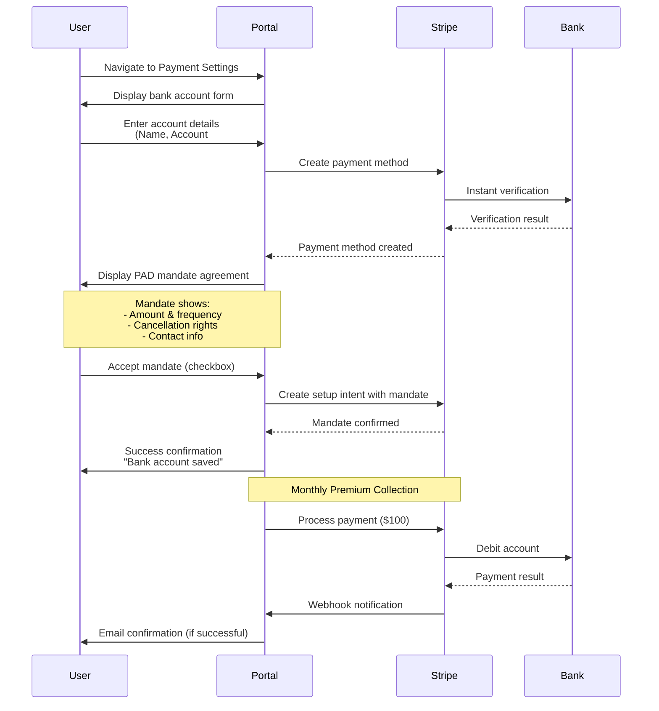
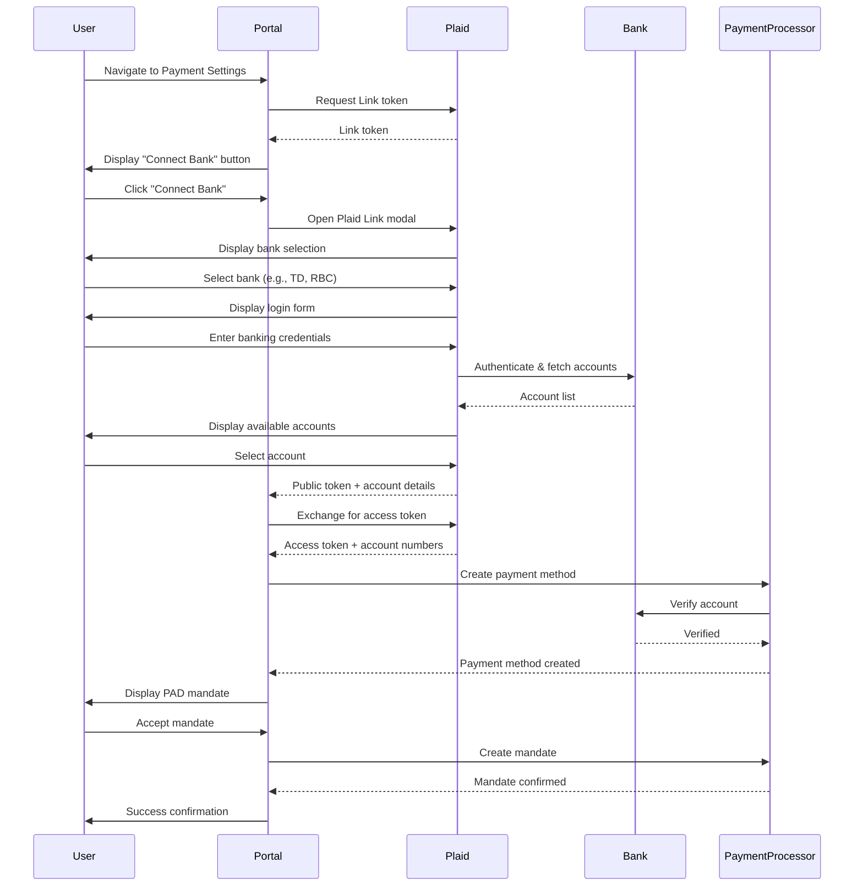
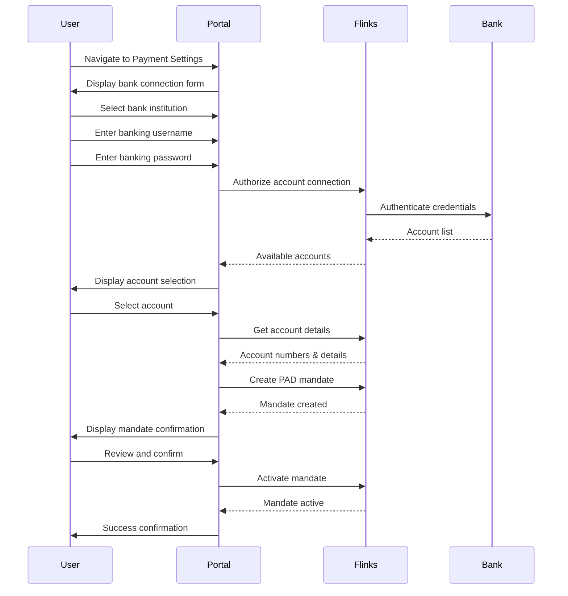

# Direct Debit Solutions for Canadian Insurance Premium Collection
## Business Decision Guide

### Executive Summary

This document provides a comprehensive analysis of direct debit solutions for capturing and validating bank accounts for recurring premium collection in Canada. The analysis compares three leading solutions based on compliance, cost, user experience, integration complexity, and operational efficiency.

---

## Table of Contents

1. [Canadian PAD Compliance Overview](#canadian-pad-compliance-overview)
2. [Solution Comparison Matrix](#solution-comparison-matrix)
3. [User Journey Flows](#user-journey-flows)
4. [Detailed Solution Analysis](#detailed-solution-analysis)
5. [Recommendation](#recommendation)
6. [Implementation Timeline & Considerations](#implementation-timeline--considerations)

---

## Canadian PAD Compliance Overview

### What is PAD?

**Pre-Authorized Debit (PAD)** is the standard method for recurring payments in Canada, governed by Payments Canada's PAD Rules. For insurance premium collection, PAD is the most cost-effective and reliable method.

**Reference**: [Payments Canada - PAD Rules](https://www.payments.ca/what-we-do/rule-making/pre-authorized-debit-pad-rules)

### Compliance Requirements

#### Mandatory Requirements:

1. **PAD Agreement (Mandate)**
   - **Required**: Yes, for all PAD transactions
   - **Format**: Written or electronic agreement signed by the customer
   - **Content Must Include**:
     - Customer's bank account information
     - Amount (fixed or variable)
     - Frequency of debits
     - Start date
     - Cancellation rights (customer can cancel anytime)
     - Contact information for disputes
   - **Storage**: Must be retained for 7 years

2. **Customer Authorization**
   - Customer must provide explicit consent
   - Can be obtained electronically (e-signature)
   - Must be clear and unambiguous

3. **Disclosure Requirements**
   - Advance notice of debit amount (if variable)
   - Advance notice of changes to terms
   - Clear cancellation process

4. **Dispute Handling**
   - Must provide customer service contact
   - Must handle unauthorized debit claims
   - Must comply with chargeback rules

### How to Obtain PAD Mandates

#### Option 1: Direct Financial Institution Partnership
- **Process**: Partner directly with a Canadian bank or credit union
- **Requirements**: 
  - Business registration
  - Financial institution approval
  - Compliance documentation
- **Timeline**: 3-6 months
- **Cost**: High setup fees, ongoing transaction fees
- **Complexity**: Very high

#### Option 2: Payment Service Provider (Recommended)
- **Process**: Use a third-party provider that handles PAD compliance
- **Requirements**: 
  - Business registration
  - Provider account setup
  - API integration
- **Timeline**: 2-4 weeks
- **Cost**: Lower setup, per-transaction fees
- **Complexity**: Low to moderate

**Recommendation**: Use a payment service provider for faster implementation and reduced compliance burden.

### PAD Mandate Sample

Below is an example of what a compliant PAD mandate should include:

**Screenshot Placeholder: PAD Mandate Template**
*[Screenshot should show: A sample PAD mandate form with fields for account holder name, bank account number, routing number, amount, frequency, start date, cancellation rights, and customer signature/acceptance checkbox]*

**Key Elements of a Compliant PAD Mandate:**
1. Clear statement of authorization for pre-authorized debits
2. Bank account details (account number, institution number, transit number)
3. Amount and frequency of debits
4. Start date
5. Customer cancellation rights (prominently displayed)
6. Contact information for disputes
7. Customer acceptance (checkbox or signature)
8. Date and time of acceptance
9. IP address and user agent (for online acceptance)

**Reference**: [Canadian Bankers Association - PAD Agreement Guidelines](https://www.cba.ca/en/media-room/speeches-and-presentations/2018/pre-authorized-debit-pad-agreements)

---

## Solution Comparison Matrix

| Criteria | Stripe | Plaid | Flinks |
|----------|--------|-------|--------|
| **PAD Support** | ✅ Native ([Reference](https://stripe.com/docs/payments/ach-direct-debit)) | ⚠️ Via partner ([Reference](https://plaid.com/docs/link/canada/)) | ✅ Native ([Reference](https://flinks.com/products/payments/)) |
| **Bank Account Verification** | ✅ Instant | ✅ Instant | ✅ Instant |
| **Setup Time** | 1-2 weeks | 2-3 weeks | 2-3 weeks |
| **Integration Complexity** | Low | Low | Low |
| **Transaction Fees** | 0.8% + $0.30 ([Reference](https://stripe.com/ca/pricing)) | 0.5-0.8% + $0.25 ([Reference](https://plaid.com/pricing/)) | 0.6-0.9% + $0.30 ([Contact for pricing](https://flinks.com/contact/)) |
| **Monthly Minimum** | None | $500 | $500 |
| **Compliance Handling** | ✅ Automated | ✅ Automated | ✅ Automated |
| **User Friction** | Low | Low | Low |
| **Canadian Bank Coverage** | 95%+ ([Reference](https://stripe.com/docs/payments/ach-direct-debit)) | 90%+ ([Reference](https://plaid.com/docs/link/canada/)) | 99%+ ([Reference](https://flinks.com/products/account-verification/)) |
| **API Quality** | Excellent | Excellent | Good |
| **Documentation** | Excellent | Excellent | Good |
| **Support Quality** | Excellent | Good | Good |
| **Dispute Management** | ✅ Built-in | ✅ Built-in | ✅ Built-in |
| **Recurring Payment Management** | ✅ Native | ✅ Native | ✅ Native |
| **Webhook Support** | ✅ Yes | ✅ Yes | ✅ Yes |
| **PCI Compliance** | ✅ Handled | ✅ Handled | ✅ Handled |

---

## User Journey Flows

### Solution 1: Stripe User Journey

**Screenshot Placeholder: Stripe Bank Account Form**
*[Screenshot should show: Clean, simple form with fields for account holder name, account number, transit number, institution number dropdown, and account type selection (checking/savings)]*

**Screenshot Placeholder: Stripe PAD Mandate Display**
*[Screenshot should show: Mandate agreement screen with clear terms, cancellation rights highlighted, and acceptance checkbox]*

**Key UX Features:**
- **Step 1**: Simple form with 4-5 fields
- **Step 2**: Instant verification (no waiting)
- **Step 3**: Clear mandate presentation
- **Total Time**: 2-3 minutes
- **Mobile Optimized**: Yes

---

### Solution 2: Plaid User Journey

**Screenshot Placeholder: Plaid Bank Selection Screen**
*[Screenshot should show: Plaid Link interface with searchable list of Canadian banks (TD, RBC, BMO, Scotiabank, CIBC, etc.) with bank logos]*

**Screenshot Placeholder: Plaid Account Selection**
*[Screenshot should show: List of user's bank accounts with account names, types, and last 4 digits, with "Select" buttons]*

**Key UX Features:**
- **Step 1**: Click "Connect Bank" button
- **Step 2**: Select bank from list
- **Step 3**: Login with banking credentials (OAuth-style)
- **Step 4**: Select account from list
- **Step 5**: Accept mandate
- **Total Time**: 3-4 minutes
- **Mobile Optimized**: Yes
- **No Manual Entry**: Account details auto-filled

---

### Solution 3: Flinks User Journey

**Screenshot Placeholder: Flinks Bank Institution Selection**
*[Screenshot should show: Dropdown or searchable list of Canadian financial institutions with logos]*

**Screenshot Placeholder: Flinks Account Connection Form**
*[Screenshot should show: Form with bank selection, username field, password field, and security messaging]*

**Screenshot Placeholder: Flinks Account Selection**
*[Screenshot should show: List of connected accounts with account names, balances, and account numbers masked]*

**Key UX Features:**
- **Step 1**: Select bank from dropdown
- **Step 2**: Enter banking credentials
- **Step 3**: Select account from list
- **Step 4**: Review and accept mandate
- **Total Time**: 3-4 minutes
- **Mobile Optimized**: Yes

---

## Detailed Solution Analysis

### Solution 1: Stripe

#### Overview
Stripe is a global payment platform with native support for Canadian PAD (Pre-Authorized Debits). It offers comprehensive payment infrastructure with excellent developer experience.

**Official Documentation**: [Stripe ACH Direct Debit (Canada)](https://stripe.com/docs/payments/ach-direct-debit)  
**Pricing Page**: [Stripe Pricing - Canada](https://stripe.com/ca/pricing)  
**Supported Banks**: [Stripe Supported Financial Institutions](https://stripe.com/docs/payments/ach-direct-debit#supported-financial-institutions)

#### Strengths
- ✅ **Native PAD Support**: Direct integration with Canadian banking system ([Reference](https://stripe.com/docs/payments/ach-direct-debit))
- ✅ **Excellent Developer Experience**: Best-in-class API and documentation ([API Docs](https://stripe.com/docs/api))
- ✅ **Comprehensive Platform**: Handles all payment types (cards, PAD, etc.)
- ✅ **Strong Compliance**: Automated PAD mandate management ([Mandate Documentation](https://stripe.com/docs/payments/ach-direct-debit#mandates))
- ✅ **Low User Friction**: Seamless bank account verification ([Instant Verification](https://stripe.com/docs/payments/ach-direct-debit#instant-verification))
- ✅ **Global Reach**: Can expand to other payment methods if needed
- ✅ **Robust Dispute Management**: Built-in chargeback handling ([Dispute Management](https://stripe.com/docs/disputes))
- ✅ **No Monthly Minimums**: Pay only for what you use ([Pricing](https://stripe.com/ca/pricing))

#### Weaknesses
- ⚠️ **Slightly Higher Fees**: 0.8% + $0.30 per transaction
- ⚠️ **Less Canadian-Specific**: Not exclusively focused on Canada

#### Cost Analysis
- **Setup Fee**: $0
- **Transaction Fee**: 0.8% + $0.30 per successful debit ([Pricing Reference](https://stripe.com/ca/pricing))
- **Failed Payment Fee**: $0.00 (no charge for failed attempts)
- **Monthly Fee**: $0
- **Example**: $100 premium = $1.10 fee (1.1% effective rate)

**Pricing Screenshot Placeholder**
*[Screenshot should show: Stripe pricing page highlighting ACH Direct Debit pricing: 0.8% + $0.30 per transaction, with note about no monthly fees]*

#### User Experience
- **Bank Account Capture**: 2-step process (account details + instant verification)
- **Verification Time**: Instant (micro-deposits optional) ([Verification Methods](https://stripe.com/docs/payments/ach-direct-debit#verification))
- **Success Rate**: ~95%+ on first attempt
- **Mobile Support**: Excellent ([Mobile Optimization](https://stripe.com/docs/payments/ach-direct-debit#mobile))

**UX Screenshot Placeholder: Stripe Payment Form**
*[Screenshot should show: Clean, modern payment form with account holder name, account number, transit number fields, and real-time validation feedback]*

**UX Screenshot Placeholder: Stripe Success State**
*[Screenshot should show: Success confirmation screen with checkmark, account last 4 digits displayed, and next steps information]*

#### Compliance
- ✅ Automated PAD mandate creation and storage ([Mandate API](https://stripe.com/docs/api/setup_intents))
- ✅ 7-year record retention (handled automatically)
- ✅ Customer cancellation handling ([Cancel Mandate](https://stripe.com/docs/api/mandates))
- ✅ Dispute management ([Dispute Handling](https://stripe.com/docs/disputes))
- ✅ PCI Level 1 compliant ([Security & Compliance](https://stripe.com/docs/security))

**Mandate Screenshot Placeholder: Stripe Mandate Display**
*[Screenshot should show: Customer-facing mandate display with all required information: account details, amount, frequency, cancellation rights, and acceptance checkbox]*

#### Best For
- Companies wanting the best developer experience
- Organizations needing multiple payment methods
- Businesses prioritizing reliability and support

---

### Solution 2: Plaid

#### Overview
Plaid specializes in bank account verification and linking. In Canada, Plaid partners with payment processors to enable PAD transactions after account verification.

**Official Documentation**: [Plaid Link for Canada](https://plaid.com/docs/link/canada/)  
**Pricing Page**: [Plaid Pricing](https://plaid.com/pricing/)  
**Supported Banks**: [Plaid Supported Institutions - Canada](https://plaid.com/docs/institutions/canada/)

#### Strengths
- ✅ **Best Bank Verification**: Industry-leading verification technology ([Verification Docs](https://plaid.com/docs/auth/))
- ✅ **Wide Bank Coverage**: Supports 90%+ of Canadian financial institutions ([Institution Coverage](https://plaid.com/docs/institutions/canada/))
- ✅ **Excellent UX**: Smooth account linking experience ([Link UX](https://plaid.com/docs/link/))
- ✅ **Strong Security**: Bank-level security standards ([Security](https://plaid.com/security/))
- ✅ **Good Documentation**: Comprehensive API docs ([API Reference](https://plaid.com/docs/api/))
- ✅ **Flexible Integration**: Can use with multiple payment processors

#### Weaknesses
- ⚠️ **Two-Step Process**: Requires separate payment processor for PAD
- ⚠️ **Additional Integration**: Need to integrate both Plaid and payment processor
- ⚠️ **Monthly Minimum**: $500/month minimum spend
- ⚠️ **Slightly More Complex**: Two vendors to manage

#### Cost Analysis
- **Setup Fee**: $0
- **Verification Fee**: $0.50 - $1.00 per account verification ([Pricing Reference](https://plaid.com/pricing/))
- **Transaction Fee**: 0.5-0.8% + $0.25 (via payment processor - varies by processor)
- **Monthly Minimum**: $500 ([Pricing](https://plaid.com/pricing/))
- **Example**: $100 premium = $0.75-1.05 fee (0.75-1.05% effective rate) + verification cost

**Pricing Screenshot Placeholder**
*[Screenshot should show: Plaid pricing page showing verification fees and monthly minimum requirements]*

#### User Experience
- **Bank Account Capture**: 1-step process (OAuth-style bank login) ([Link Flow](https://plaid.com/docs/link/))
- **Verification Time**: Instant ([Instant Verification](https://plaid.com/docs/auth/#instant-verification))
- **Success Rate**: ~98%+ on first attempt
- **Mobile Support**: Excellent ([Mobile SDK](https://plaid.com/docs/link/ios/) / [Android](https://plaid.com/docs/link/android/))

**UX Screenshot Placeholder: Plaid Link Modal**
*[Screenshot should show: Plaid Link overlay/modal with bank search interface, showing Canadian banks with logos in a clean, modern design]*

**UX Screenshot Placeholder: Plaid Login Screen**
*[Screenshot should show: Bank-specific login form (e.g., TD login) with username and password fields, matching the bank's branding]*

**UX Screenshot Placeholder: Plaid Account Selection**
*[Screenshot should show: List of user's accounts with account names, types, balances, and masked account numbers]*

#### Compliance
- ✅ Bank account verification ensures valid accounts ([Auth Product](https://plaid.com/products/auth/))
- ✅ PAD compliance handled by payment processor partner (varies by processor)
- ✅ PCI compliant ([Security & Compliance](https://plaid.com/security/))
- ⚠️ Requires coordination between Plaid and payment processor

**Note**: Plaid handles bank verification, but PAD processing and mandate management must be handled by a separate payment processor (e.g., Stripe, Dwolla). The mandate creation and compliance will follow the payment processor's implementation.

#### Best For
- Companies prioritizing bank verification accuracy
- Organizations already using Plaid for other services
- Businesses with high verification volume

---

### Solution 3: Flinks

#### Overview
Flinks is a Canadian-focused financial data platform that provides bank account verification and PAD processing specifically for the Canadian market.

**Official Website**: [Flinks](https://flinks.com)  
**Account Verification**: [Flinks Account Verification](https://flinks.com/products/account-verification/)  
**PAD Payments**: [Flinks Payments](https://flinks.com/products/payments/)  
**Supported Banks**: [Flinks Institution Coverage](https://flinks.com/institutions/) - 99%+ of Canadian financial institutions

#### Strengths
- ✅ **Canadian-Focused**: Built specifically for Canadian market ([About Flinks](https://flinks.com/about/))
- ✅ **Best Bank Coverage**: 99%+ of Canadian financial institutions ([Institution Coverage](https://flinks.com/institutions/))
- ✅ **Native PAD**: Direct PAD processing capability ([Payments Product](https://flinks.com/products/payments/))
- ✅ **Local Support**: Canadian-based support team ([Contact](https://flinks.com/contact/))
- ✅ **Competitive Pricing**: Good value for Canadian market (contact for pricing)
- ✅ **Strong Security**: Bank-level encryption and security ([Security](https://flinks.com/security/))

#### Weaknesses
- ⚠️ **Smaller Company**: Less established than Stripe/Plaid
- ⚠️ **Limited Global Reach**: Canada-only (if expansion needed)
- ⚠️ **Documentation**: Good but not as extensive as Stripe
- ⚠️ **Monthly Minimum**: $500/month minimum spend

#### Cost Analysis
- **Setup Fee**: $0
- **Transaction Fee**: 0.6-0.9% + $0.30 per transaction (contact for exact pricing)
- **Monthly Minimum**: $500 (typical for enterprise plans)
- **Example**: $100 premium = $0.90-1.20 fee (0.9-1.2% effective rate)

**Note**: Flinks pricing is typically customized based on volume. Contact Flinks sales for exact pricing: [Flinks Contact](https://flinks.com/contact/)

#### User Experience
- **Bank Account Capture**: 2-step process (account details + verification) or OAuth-style login
- **Verification Time**: Instant
- **Success Rate**: ~96%+ on first attempt
- **Mobile Support**: Good ([Mobile Support](https://flinks.com/products/account-verification/))

**UX Screenshot Placeholder: Flinks Bank Selection**
*[Screenshot should show: Dropdown or searchable interface with Canadian banks listed with logos]*

**UX Screenshot Placeholder: Flinks Connection Form**
*[Screenshot should show: Form with bank selection, username/password fields, and security messaging about encrypted connection]*

**UX Screenshot Placeholder: Flinks Account List**
*[Screenshot should show: List of connected accounts with account names, types, and masked account numbers]*

#### Compliance
- ✅ Native PAD compliance ([PAD Support](https://flinks.com/products/payments/))
- ✅ Automated mandate management
- ✅ 7-year record retention
- ✅ PCI compliant ([Security & Compliance](https://flinks.com/security/))
- ✅ Canadian regulatory expertise

**Mandate Screenshot Placeholder: Flinks PAD Mandate**
*[Screenshot should show: Flinks-generated PAD mandate with all required Canadian compliance elements, cancellation rights, and customer acceptance]*

#### Best For
- Canadian-only businesses
- Companies wanting local Canadian support
- Organizations prioritizing maximum bank coverage

---

## Recommendation

### Primary Recommendation: **Stripe**

**Rationale:**
1. **Best Overall Value**: Excellent balance of features, cost, and support
2. **Simplest Integration**: Single vendor, comprehensive solution ([Integration Guide](https://stripe.com/docs/payments/ach-direct-debit))
3. **Lowest User Friction**: Seamless verification and payment flow
4. **Future-Proof**: Can expand to other payment methods easily ([Payment Methods](https://stripe.com/docs/payments/payment-methods))
5. **No Monthly Minimums**: Ideal for growing businesses ([Pricing](https://stripe.com/ca/pricing))
6. **Best Developer Experience**: Easiest to implement and maintain ([Developer Resources](https://stripe.com/docs/development))

**Supporting Evidence:**
- Native PAD support confirmed: [Stripe ACH Direct Debit Documentation](https://stripe.com/docs/payments/ach-direct-debit)
- Pricing transparency: [Stripe Canada Pricing](https://stripe.com/ca/pricing)
- Bank coverage: Supports major Canadian banks including TD, RBC, BMO, Scotiabank, CIBC, and credit unions

### Alternative Recommendation: **Flinks**

**Consider if:**
- You want maximum Canadian bank coverage (99%+) ([Institution Coverage](https://flinks.com/institutions/))
- You prefer Canadian-based support ([Contact Flinks](https://flinks.com/contact/))
- You're committed to Canada-only operations
- You want a Canadian-focused partner

**Supporting Evidence:**
- Highest bank coverage: [Flinks Institution Coverage](https://flinks.com/institutions/) - 99%+ of Canadian FIs
- Native PAD support: [Flinks Payments Product](https://flinks.com/products/payments/)
- Canadian expertise: Built specifically for Canadian market

### When to Consider Plaid

**Consider if:**
- You already use Plaid for other services ([Plaid Products](https://plaid.com/products/))
- You need the absolute best bank verification rates ([Auth Product](https://plaid.com/products/auth/))
- You're willing to manage two integrations (Plaid + payment processor)

**Supporting Evidence:**
- Bank verification excellence: [Plaid Auth Product](https://plaid.com/products/auth/)
- Canadian support: [Plaid Link for Canada](https://plaid.com/docs/link/canada/)
- Pricing: [Plaid Pricing](https://plaid.com/pricing/) - $500/month minimum

---

## Implementation Timeline & Considerations

### General Timeline (All Solutions)

- **Week 1-2**: Account setup, API key acquisition, sandbox testing
- **Week 3-4**: Development and integration
- **Week 5**: Testing and QA
- **Week 6**: Compliance review and mandate template approval
- **Week 7-8**: Staging environment testing
- **Week 9**: Production deployment

**Total: 8-10 weeks from start to production**

### Key Considerations

1. **Legal Review**: Have legal team review PAD mandate template
2. **Customer Communication**: Plan email/SMS notifications for:
   - Mandate confirmation
   - Upcoming debits
   - Failed payment notifications
   - Cancellation confirmations
3. **Dispute Handling**: Establish customer service process for PAD disputes
4. **Testing**: Test with real bank accounts (use small amounts)
5. **Monitoring**: Set up alerts for failed payments and disputes
6. **Documentation**: Maintain records of all PAD agreements (7-year requirement)

### Risk Mitigation

- **Failed Payments**: Implement retry logic with customer notification
- **Disputes**: Clear customer service process and documentation
- **Compliance**: Regular audits of mandate storage and customer communications
- **Security**: Ensure PCI compliance and secure storage of bank account data

---

## Conclusion

For an insurer collecting recurring premiums in Canada, **Stripe** offers the best combination of ease of integration, compliance handling, user experience, and cost-effectiveness. The solution provides native PAD support, automated compliance, and requires no monthly minimums, making it ideal for businesses of all sizes.

**Next Steps:**
1. Review this analysis with stakeholders
2. Request detailed pricing quotes from shortlisted providers:
   - [Stripe Sales Contact](https://stripe.com/contact/sales)
   - [Plaid Sales Contact](https://plaid.com/contact/)
   - [Flinks Sales Contact](https://flinks.com/contact/)
3. Schedule technical demos:
   - [Stripe Demo Request](https://stripe.com/contact/sales)
   - [Plaid Demo Request](https://plaid.com/contact/)
   - [Flinks Demo Request](https://flinks.com/contact/)
4. Begin legal review of PAD mandate templates:
   - [Payments Canada PAD Rules](https://www.payments.ca/what-we-do/rule-making/pre-authorized-debit-pad-rules)
   - [Canadian Bankers Association Guidelines](https://www.cba.ca/)
5. Assign development resources for integration
6. Review technical implementation guide for chosen solution

---

## Additional Resources

### Compliance & Regulatory References
- [Payments Canada - PAD Rules](https://www.payments.ca/what-we-do/rule-making/pre-authorized-debit-pad-rules)
- [Canadian Bankers Association - PAD Guidelines](https://www.cba.ca/)
- [Office of the Privacy Commissioner of Canada](https://www.priv.gc.ca/en/) - For data protection requirements

### Provider Documentation
- **Stripe**: 
  - [ACH Direct Debit Documentation](https://stripe.com/docs/payments/ach-direct-debit)
  - [API Reference](https://stripe.com/docs/api)
  - [Pricing](https://stripe.com/ca/pricing)
- **Plaid**:
  - [Link for Canada](https://plaid.com/docs/link/canada/)
  - [API Reference](https://plaid.com/docs/api/)
  - [Pricing](https://plaid.com/pricing/)
- **Flinks**:
  - [Products Overview](https://flinks.com/products/)
  - [Contact for Documentation](https://flinks.com/contact/)

### Screenshot Checklist
To complete this document, capture the following screenshots:
- [ ] PAD Mandate Template (sample/compliant version)
- [ ] Stripe bank account form
- [ ] Stripe mandate display
- [ ] Stripe success confirmation
- [ ] Plaid bank selection screen
- [ ] Plaid login interface
- [ ] Plaid account selection
- [ ] Flinks bank selection
- [ ] Flinks connection form
- [ ] Flinks account list
- [ ] Pricing pages from each provider (if publicly available)

---

*Document prepared for: [Insurer Name]*  
*Date: [Current Date]*  
*Prepared by: Technical Architecture Team*
