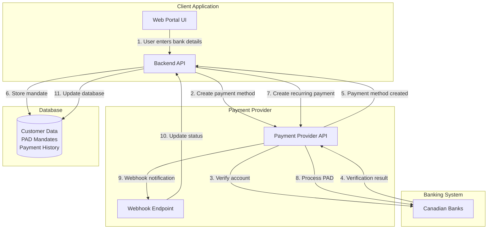
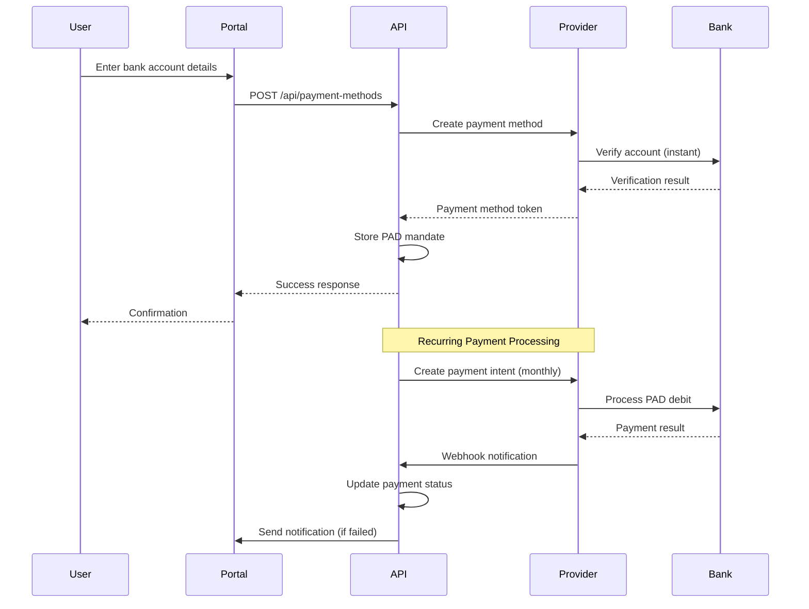

# Direct Debit Integration Guide for Canadian Insurance Premiums
## Technical Implementation Documentation

### Overview

This document provides complete technical implementation details for integrating direct debit (PAD) solutions for Canadian insurance premium collection. It includes API samples, architecture diagrams, code examples, and step-by-step integration instructions for three solutions: Stripe, Plaid, and Flinks.

---

## Table of Contents

1. [Architecture Overview](#architecture-overview)
2. [Solution 1: Stripe Integration](#solution-1-stripe-integration)
3. [Solution 2: Plaid Integration](#solution-2-plaid-integration)
4. [Solution 3: Flinks Integration](#solution-3-flinks-integration)
5. [Common Implementation Patterns](#common-implementation-patterns)
6. [Security & Compliance](#security--compliance)
7. [Testing Strategy](#testing-strategy)
8. [Error Handling & Monitoring](#error-handling--monitoring)

---

## Architecture Overview

### System Architecture



### Payment Flow



---

## Solution 1: Stripe Integration

### Prerequisites

1. Stripe account (sign up at https://stripe.com)
2. API keys (test and live)
3. Webhook endpoint configured
4. Node.js/Python/other backend with Stripe SDK

### Setup

#### 1. Install Dependencies

```bash
# Node.js
npm install stripe

# Python
pip install stripe

# PHP
composer require stripe/stripe-php
```

#### 2. Initialize Stripe Client

```javascript
// Node.js
const stripe = require('stripe')(process.env.STRIPE_SECRET_KEY);

// Python
import stripe
stripe.api_key = os.getenv('STRIPE_SECRET_KEY')

// PHP
\Stripe\Stripe::setApiKey(getenv('STRIPE_SECRET_KEY'));
```

### API Integration

#### Step 1: Create Payment Method (Bank Account)

**Endpoint**: `POST /v1/payment_methods`

```bash
curl https://api.stripe.com/v1/payment_methods \
  -u sk_test_...: \
  -d type=us_bank_account \
  -d "billing_details[name]=John Doe" \
  -d "billing_details[email]=john@example.com" \
  -d "us_bank_account[account_holder_type]=individual" \
  -d "us_bank_account[account_number]=000123456789" \
  -d "us_bank_account[routing_number]=110000000" \
  -d "us_bank_account[account_type]=checking"
```

**Note**: For Canadian PAD, use `type=link` or `type=us_bank_account` with Canadian routing numbers.

**Response**:
```json
{
  "id": "pm_1234567890",
  "object": "payment_method",
  "type": "us_bank_account",
  "us_bank_account": {
    "account_holder_type": "individual",
    "account_type": "checking",
    "bank_name": "TD Canada Trust",
    "last4": "6789",
    "routing_number": "0004"
  },
  "billing_details": {
    "name": "John Doe",
    "email": "john@example.com"
  }
}
```

#### Step 2: Verify Bank Account (Instant Verification)

**Endpoint**: `POST /v1/payment_methods/{id}/verify_microdeposits`

Stripe supports instant verification for Canadian banks:

```bash
curl https://api.stripe.com/v1/payment_methods/pm_1234567890/verify_microdeposits \
  -u sk_test_...: \
  -d amounts[]=32 \
  -d amounts[]=45
```

**Alternative: Instant Verification (Preferred)**

```bash
curl https://api.stripe.com/v1/payment_methods/pm_1234567890/attach \
  -u sk_test_...: \
  -d customer=cus_1234567890
```

#### Step 3: Create Customer

**Endpoint**: `POST /v1/customers`

```bash
curl https://api.stripe.com/v1/customers \
  -u sk_test_...: \
  -d email=john@example.com \
  -d name="John Doe" \
  -d metadata[policy_number]=POL-12345 \
  -d metadata[premium_amount]=100.00
```

#### Step 4: Attach Payment Method to Customer

**Endpoint**: `POST /v1/payment_methods/{id}/attach`

```bash
curl https://api.stripe.com/v1/payment_methods/pm_1234567890/attach \
  -u sk_test_...: \
  -d customer=cus_1234567890
```

#### Step 5: Create PAD Mandate (Setup Intent)

**Endpoint**: `POST /v1/setup_intents`

```bash
curl https://api.stripe.com/v1/setup_intents \
  -u sk_test_...: \
  -d customer=cus_1234567890 \
  -d payment_method=pm_1234567890 \
  -d payment_method_types[]=us_bank_account \
  -d usage=off_session \
  -d "mandate_data[customer_acceptance][type]=online" \
  -d "mandate_data[customer_acceptance[online][ip_address]=192.168.1.1" \
  -d "mandate_data[customer_acceptance[online][user_agent]=Mozilla/5.0..."
```

**Response**:
```json
{
  "id": "seti_1234567890",
  "object": "setup_intent",
  "status": "succeeded",
  "mandate": {
    "id": "mandate_1234567890",
    "type": "multi_use",
    "customer_acceptance": {
      "type": "online",
      "online": {
        "ip_address": "192.168.1.1",
        "user_agent": "Mozilla/5.0..."
      }
    }
  }
}
```

#### Step 6: Create Recurring Payment (Payment Intent)

**Endpoint**: `POST /v1/payment_intents`

```bash
curl https://api.stripe.com/v1/payment_intents \
  -u sk_test_...: \
  -d amount=10000 \
  -d currency=cad \
  -d customer=cus_1234567890 \
  -d payment_method=pm_1234567890 \
  -d confirmation_method=automatic \
  -d confirm=true \
  -d off_session=true \
  -d mandate=mandate_1234567890 \
  -d metadata[policy_number]=POL-12345 \
  -d metadata[premium_month]=2024-01
```

**Response**:
```json
{
  "id": "pi_1234567890",
  "object": "payment_intent",
  "amount": 10000,
  "currency": "cad",
  "status": "succeeded",
  "payment_method": "pm_1234567890",
  "mandate": "mandate_1234567890"
}
```

### Complete Implementation Example

#### Backend API (Node.js/Express)

```javascript
const express = require('express');
const stripe = require('stripe')(process.env.STRIPE_SECRET_KEY);
const router = express.Router();

// Step 1: Create payment method
router.post('/api/payment-methods', async (req, res) => {
  try {
    const { accountNumber, routingNumber, accountType, accountHolderName, email } = req.body;
    
    // Create payment method
    const paymentMethod = await stripe.paymentMethods.create({
      type: 'us_bank_account',
      us_bank_account: {
        account_number: accountNumber,
        routing_number: routingNumber,
        account_type: accountType, // 'checking' or 'savings'
        account_holder_type: 'individual',
      },
      billing_details: {
        name: accountHolderName,
        email: email,
      },
    });
    
    res.json({ paymentMethodId: paymentMethod.id });
  } catch (error) {
    res.status(400).json({ error: error.message });
  }
});

// Step 2: Create customer and attach payment method
router.post('/api/customers/:customerId/payment-methods/:paymentMethodId/attach', async (req, res) => {
  try {
    const { customerId, paymentMethodId } = req.params;
    
    // Attach payment method to customer
    await stripe.paymentMethods.attach(paymentMethodId, {
      customer: customerId,
    });
    
    // Create setup intent for PAD mandate
    const setupIntent = await stripe.setupIntents.create({
      customer: customerId,
      payment_method: paymentMethodId,
      payment_method_types: ['us_bank_account'],
      usage: 'off_session',
      mandate_data: {
        customer_acceptance: {
          type: 'online',
          online: {
            ip_address: req.ip,
            user_agent: req.get('user-agent'),
          },
        },
      },
    });
    
    res.json({ 
      setupIntentId: setupIntent.id,
      mandateId: setupIntent.mandate.id,
      status: setupIntent.status 
    });
  } catch (error) {
    res.status(400).json({ error: error.message });
  }
});

// Step 3: Process recurring payment
router.post('/api/payments/process', async (req, res) => {
  try {
    const { customerId, paymentMethodId, amount, mandateId, policyNumber, premiumMonth } = req.body;
    
    const paymentIntent = await stripe.paymentIntents.create({
      amount: Math.round(amount * 100), // Convert to cents
      currency: 'cad',
      customer: customerId,
      payment_method: paymentMethodId,
      confirmation_method: 'automatic',
      confirm: true,
      off_session: true,
      mandate: mandateId,
      metadata: {
        policy_number: policyNumber,
        premium_month: premiumMonth,
      },
    });
    
    res.json({ 
      paymentIntentId: paymentIntent.id,
      status: paymentIntent.status 
    });
  } catch (error) {
    res.status(400).json({ error: error.message });
  }
});

// Webhook handler
router.post('/api/webhooks/stripe', express.raw({type: 'application/json'}), async (req, res) => {
  const sig = req.headers['stripe-signature'];
  let event;
  
  try {
    event = stripe.webhooks.constructEvent(req.body, sig, process.env.STRIPE_WEBHOOK_SECRET);
  } catch (err) {
    return res.status(400).send(`Webhook Error: ${err.message}`);
  }
  
  // Handle the event
  switch (event.type) {
    case 'payment_intent.succeeded':
      const paymentIntent = event.data.object;
      // Update database: mark payment as successful
      await updatePaymentStatus(paymentIntent.id, 'succeeded');
      break;
      
    case 'payment_intent.payment_failed':
      const failedPayment = event.data.object;
      // Update database: mark payment as failed
      await updatePaymentStatus(failedPayment.id, 'failed');
      // Send notification to customer
      await sendFailedPaymentNotification(failedPayment.customer);
      break;
      
    default:
      console.log(`Unhandled event type ${event.type}`);
  }
  
  res.json({received: true});
});

module.exports = router;
```

#### Frontend Integration (React)

```jsx
import React, { useState } from 'react';
import { loadStripe } from '@stripe/stripe-js';

const stripePromise = loadStripe(process.env.REACT_APP_STRIPE_PUBLISHABLE_KEY);

function BankAccountForm({ customerId, onSuccess }) {
  const [formData, setFormData] = useState({
    accountNumber: '',
    routingNumber: '',
    accountType: 'checking',
    accountHolderName: '',
    email: '',
  });
  const [loading, setLoading] = useState(false);
  const [error, setError] = useState(null);

  const handleSubmit = async (e) => {
    e.preventDefault();
    setLoading(true);
    setError(null);

    try {
      // Step 1: Create payment method
      const pmResponse = await fetch('/api/payment-methods', {
        method: 'POST',
        headers: { 'Content-Type': 'application/json' },
        body: JSON.stringify(formData),
      });
      
      if (!pmResponse.ok) throw new Error('Failed to create payment method');
      const { paymentMethodId } = await pmResponse.json();

      // Step 2: Attach to customer and create mandate
      const attachResponse = await fetch(
        `/api/customers/${customerId}/payment-methods/${paymentMethodId}/attach`,
        { method: 'POST' }
      );
      
      if (!attachResponse.ok) throw new Error('Failed to create mandate');
      const { mandateId, status } = await attachResponse.json();

      if (status === 'succeeded') {
        onSuccess({ paymentMethodId, mandateId });
      }
    } catch (err) {
      setError(err.message);
    } finally {
      setLoading(false);
    }
  };

  return (
    <form onSubmit={handleSubmit}>
      <div>
        <label>Account Holder Name</label>
        <input
          type="text"
          value={formData.accountHolderName}
          onChange={(e) => setFormData({...formData, accountHolderName: e.target.value})}
          required
        />
      </div>
      
      <div>
        <label>Email</label>
        <input
          type="email"
          value={formData.email}
          onChange={(e) => setFormData({...formData, email: e.target.value})}
          required
        />
      </div>
      
      <div>
        <label>Routing Number (Transit Number)</label>
        <input
          type="text"
          value={formData.routingNumber}
          onChange={(e) => setFormData({...formData, routingNumber: e.target.value})}
          required
        />
      </div>
      
      <div>
        <label>Account Number</label>
        <input
          type="text"
          value={formData.accountNumber}
          onChange={(e) => setFormData({...formData, accountNumber: e.target.value})}
          required
        />
      </div>
      
      <div>
        <label>Account Type</label>
        <select
          value={formData.accountType}
          onChange={(e) => setFormData({...formData, accountType: e.target.value})}
        >
          <option value="checking">Checking</option>
          <option value="savings">Savings</option>
        </select>
      </div>
      
      {error && <div className="error">{error}</div>}
      
      <button type="submit" disabled={loading}>
        {loading ? 'Processing...' : 'Save Bank Account'}
      </button>
    </form>
  );
}

export default BankAccountForm;
```

### Database Schema

```sql
-- Customers table
CREATE TABLE customers (
    id UUID PRIMARY KEY DEFAULT gen_random_uuid(),
    stripe_customer_id VARCHAR(255) UNIQUE NOT NULL,
    email VARCHAR(255) NOT NULL,
    name VARCHAR(255) NOT NULL,
    policy_number VARCHAR(100),
    created_at TIMESTAMP DEFAULT NOW(),
    updated_at TIMESTAMP DEFAULT NOW()
);

-- Payment methods table
CREATE TABLE payment_methods (
    id UUID PRIMARY KEY DEFAULT gen_random_uuid(),
    customer_id UUID REFERENCES customers(id),
    stripe_payment_method_id VARCHAR(255) UNIQUE NOT NULL,
    bank_name VARCHAR(255),
    last4 VARCHAR(4),
    account_type VARCHAR(20),
    is_default BOOLEAN DEFAULT false,
    created_at TIMESTAMP DEFAULT NOW()
);

-- PAD mandates table
CREATE TABLE pad_mandates (
    id UUID PRIMARY KEY DEFAULT gen_random_uuid(),
    customer_id UUID REFERENCES customers(id),
    payment_method_id UUID REFERENCES payment_methods(id),
    stripe_mandate_id VARCHAR(255) UNIQUE NOT NULL,
    status VARCHAR(50) NOT NULL,
    accepted_at TIMESTAMP,
    ip_address VARCHAR(45),
    user_agent TEXT,
    created_at TIMESTAMP DEFAULT NOW()
);

-- Payments table
CREATE TABLE payments (
    id UUID PRIMARY KEY DEFAULT gen_random_uuid(),
    customer_id UUID REFERENCES customers(id),
    payment_method_id UUID REFERENCES payment_methods(id),
    mandate_id UUID REFERENCES pad_mandates(id),
    stripe_payment_intent_id VARCHAR(255) UNIQUE NOT NULL,
    amount DECIMAL(10, 2) NOT NULL,
    currency VARCHAR(3) DEFAULT 'CAD',
    status VARCHAR(50) NOT NULL,
    policy_number VARCHAR(100),
    premium_month VARCHAR(20),
    failure_reason TEXT,
    processed_at TIMESTAMP,
    created_at TIMESTAMP DEFAULT NOW()
);

-- Indexes
CREATE INDEX idx_payments_customer ON payments(customer_id);
CREATE INDEX idx_payments_status ON payments(status);
CREATE INDEX idx_payments_processed_at ON payments(processed_at);
```

---

## Solution 2: Plaid Integration

### Prerequisites

1. Plaid account (sign up at https://plaid.com)
2. API keys (sandbox, development, production)
3. Payment processor partner (e.g., Stripe, Dwolla) for PAD processing
4. Backend with Plaid SDK

### Setup

#### 1. Install Dependencies

```bash
# Node.js
npm install plaid

# Python
pip install plaid-python

# PHP
composer require plaid/plaid-php
```

#### 2. Initialize Plaid Client

```javascript
// Node.js
const { Configuration, PlaidApi, PlaidEnvironments } = require('plaid');

const configuration = new Configuration({
  basePath: PlaidEnvironments[process.env.PLAID_ENV || 'sandbox'],
  baseOptions: {
    headers: {
      'PLAID-CLIENT-ID': process.env.PLAID_CLIENT_ID,
      'PLAID-SECRET': process.env.PLAID_SECRET,
    },
  },
});

const plaidClient = new PlaidApi(configuration);
```

### API Integration

#### Step 1: Create Link Token

**Endpoint**: `POST /link/token/create`

```bash
curl -X POST https://sandbox.plaid.com/link/token/create \
  -H 'Content-Type: application/json' \
  -d '{
    "client_id": "your_client_id",
    "secret": "your_secret",
    "client_name": "Insurance Premium Portal",
    "products": ["auth", "identity"],
    "country_codes": ["CA"],
    "language": "en",
    "user": {
      "client_user_id": "unique_user_id_12345"
    },
    "webhook": "https://your-domain.com/api/webhooks/plaid"
  }'
```

**Response**:
```json
{
  "link_token": "link-sandbox-abc123",
  "expiration": "2024-12-31T23:59:59Z",
  "request_id": "abc-123-def-456"
}
```

#### Step 2: Exchange Public Token for Access Token

**Endpoint**: `POST /item/public_token/exchange`

After user completes Plaid Link flow:

```bash
curl -X POST https://sandbox.plaid.com/item/public_token/exchange \
  -H 'Content-Type: application/json' \
  -d '{
    "client_id": "your_client_id",
    "secret": "your_secret",
    "public_token": "public-sandbox-abc123"
  }'
```

**Response**:
```json
{
  "access_token": "access-sandbox-abc123",
  "item_id": "item-123",
  "request_id": "abc-123-def-456"
}
```

#### Step 3: Get Bank Account Details

**Endpoint**: `POST /accounts/get`

```bash
curl -X POST https://sandbox.plaid.com/accounts/get \
  -H 'Content-Type: application/json' \
  -d '{
    "client_id": "your_client_id",
    "secret": "your_secret",
    "access_token": "access-sandbox-abc123"
  }'
```

**Response**:
```json
{
  "accounts": [
    {
      "account_id": "acc-123",
      "name": "Checking Account",
      "type": "depository",
      "subtype": "checking",
      "mask": "0000",
      "verification_status": "automatically_verified"
    }
  ],
  "item": {
    "item_id": "item-123",
    "institution_id": "ins_109508"
  }
}
```

#### Step 4: Get Account & Routing Numbers

**Endpoint**: `POST /auth/get`

```bash
curl -X POST https://sandbox.plaid.com/auth/get \
  -H 'Content-Type: application/json' \
  -d '{
    "client_id": "your_client_id",
    "secret": "your_secret",
    "access_token": "access-sandbox-abc123"
  }'
```

**Response**:
```json
{
  "accounts": [
    {
      "account_id": "acc-123",
      "numbers": {
        "ach": [
          {
            "account": "9900000006",
            "routing": "011401533",
            "wire_routing": "021000021"
          }
        ]
      }
    }
  ]
}
```

### Complete Implementation Example

#### Backend API (Node.js/Express)

```javascript
const express = require('express');
const { Configuration, PlaidApi, PlaidEnvironments } = require('plaid');
const stripe = require('stripe')(process.env.STRIPE_SECRET_KEY); // For PAD processing

const router = express.Router();

const plaidClient = new PlaidApi(new Configuration({
  basePath: PlaidEnvironments[process.env.PLAID_ENV],
  baseOptions: {
    headers: {
      'PLAID-CLIENT-ID': process.env.PLAID_CLIENT_ID,
      'PLAID-SECRET': process.env.PLAID_SECRET,
    },
  },
}));

// Step 1: Create Link token
router.post('/api/plaid/link-token', async (req, res) => {
  try {
    const { userId } = req.body;
    
    const request = {
      client_name: 'Insurance Premium Portal',
      products: ['auth', 'identity'],
      country_codes: ['CA'],
      language: 'en',
      user: {
        client_user_id: userId,
      },
      webhook: `${process.env.APP_URL}/api/webhooks/plaid`,
    };
    
    const response = await plaidClient.linkTokenCreate(request);
    res.json({ linkToken: response.data.link_token });
  } catch (error) {
    res.status(400).json({ error: error.message });
  }
});

// Step 2: Exchange public token for access token
router.post('/api/plaid/exchange-token', async (req, res) => {
  try {
    const { publicToken, customerId } = req.body;
    
    // Exchange public token
    const exchangeResponse = await plaidClient.itemPublicTokenExchange({
      public_token: publicToken,
    });
    
    const accessToken = exchangeResponse.data.access_token;
    const itemId = exchangeResponse.data.item_id;
    
    // Get account details
    const accountsResponse = await plaidClient.accountsGet({
      access_token: accessToken,
    });
    
    // Get account numbers
    const authResponse = await plaidClient.authGet({
      access_token: accessToken,
    });
    
    const account = accountsResponse.data.accounts[0];
    const accountNumbers = authResponse.data.numbers.ach[0];
    
    // Create payment method in Stripe (or other payment processor)
    const paymentMethod = await stripe.paymentMethods.create({
      type: 'us_bank_account',
      us_bank_account: {
        account_number: accountNumbers.account,
        routing_number: accountNumbers.routing,
        account_type: account.subtype === 'checking' ? 'checking' : 'savings',
        account_holder_type: 'individual',
      },
    });
    
    // Attach to customer
    await stripe.paymentMethods.attach(paymentMethod.id, {
      customer: customerId,
    });
    
    // Create PAD mandate
    const setupIntent = await stripe.setupIntents.create({
      customer: customerId,
      payment_method: paymentMethod.id,
      payment_method_types: ['us_bank_account'],
      usage: 'off_session',
      mandate_data: {
        customer_acceptance: {
          type: 'online',
          online: {
            ip_address: req.ip,
            user_agent: req.get('user-agent'),
          },
        },
      },
    });
    
    // Store in database
    await storePlaidAccount({
      customerId,
      plaidAccessToken: accessToken,
      plaidItemId: itemId,
      accountId: account.account_id,
      stripePaymentMethodId: paymentMethod.id,
      stripeMandateId: setupIntent.mandate.id,
    });
    
    res.json({
      paymentMethodId: paymentMethod.id,
      mandateId: setupIntent.mandate.id,
      accountName: account.name,
      accountMask: account.mask,
    });
  } catch (error) {
    res.status(400).json({ error: error.message });
  }
});

// Webhook handler
router.post('/api/webhooks/plaid', async (req, res) => {
  const { webhook_type, webhook_code, item_id } = req.body;
  
  switch (webhook_type) {
    case 'AUTH':
      if (webhook_code === 'AUTOMATICALLY_VERIFIED') {
        // Account automatically verified
        await updateAccountVerificationStatus(item_id, 'verified');
      }
      break;
      
    case 'ERROR':
      // Handle errors
      console.error('Plaid error:', req.body);
      break;
      
    default:
      console.log(`Unhandled webhook: ${webhook_type}`);
  }
  
  res.json({ received: true });
});

module.exports = router;
```

#### Frontend Integration (React with Plaid Link)

```jsx
import React, { useEffect, useState } from 'react';
import { usePlaidLink } from 'react-plaid-link';

function PlaidBankLink({ customerId, onSuccess }) {
  const [linkToken, setLinkToken] = useState(null);
  const [loading, setLoading] = useState(true);

  useEffect(() => {
    // Fetch link token
    fetch('/api/plaid/link-token', {
      method: 'POST',
      headers: { 'Content-Type': 'application/json' },
      body: JSON.stringify({ userId: customerId }),
    })
      .then(res => res.json())
      .then(data => {
        setLinkToken(data.linkToken);
        setLoading(false);
      })
      .catch(err => {
        console.error('Error fetching link token:', err);
        setLoading(false);
      });
  }, [customerId]);

  const { open, ready } = usePlaidLink({
    token: linkToken,
    onSuccess: async (publicToken, metadata) => {
      try {
        const response = await fetch('/api/plaid/exchange-token', {
          method: 'POST',
          headers: { 'Content-Type': 'application/json' },
          body: JSON.stringify({
            publicToken,
            customerId,
          }),
        });
        
        const data = await response.json();
        onSuccess(data);
      } catch (error) {
        console.error('Error exchanging token:', error);
      }
    },
    onExit: (err, metadata) => {
      if (err) {
        console.error('Plaid Link error:', err);
      }
    },
  });

  if (loading) return <div>Loading...</div>;

  return (
    <button onClick={() => open()} disabled={!ready}>
      Connect Bank Account
    </button>
  );
}

export default PlaidBankLink;
```

---

## Solution 3: Flinks Integration

### Prerequisites

1. Flinks account (sign up at https://flinks.com)
2. API credentials
3. Backend with Flinks SDK or REST API client

### Setup

#### 1. Install Dependencies

```bash
# Node.js - Flinks uses REST API, so use axios or fetch
npm install axios

# Python
pip install requests
```

### API Integration

#### Step 1: Initialize Account Connection

**Endpoint**: `POST /api/v3/Account/Authorize`

```bash
curl -X POST https://api.flinks.io/api/v3/Account/Authorize \
  -H 'Content-Type: application/json' \
  -H 'Authorization: Bearer YOUR_API_KEY' \
  -d '{
    "username": "user_banking_username",
    "password": "user_banking_password",
    "institution": "td",
    "requestId": "unique_request_id_12345",
    "mostRecentCached": false
  }'
```

**Response**:
```json
{
  "RequestId": "unique_request_id_12345",
  "Login": {
    "Id": "login_123",
    "Username": "user_banking_username",
    "Institution": "td"
  },
  "Accounts": [
    {
      "Id": "account_123",
      "Name": "Chequing Account",
      "Type": "CHECKING",
      "Number": "****1234",
      "Balance": 5000.00
    }
  ]
}
```

#### Step 2: Get Account Details

**Endpoint**: `POST /api/v3/Account/GetSummary`

```bash
curl -X POST https://api.flinks.io/api/v3/Account/GetSummary \
  -H 'Content-Type: application/json' \
  -H 'Authorization: Bearer YOUR_API_KEY' \
  -d '{
    "requestId": "unique_request_id_12345",
    "loginId": "login_123",
    "mostRecentCached": false
  }'
```

**Response**:
```json
{
  "RequestId": "unique_request_id_12345",
  "Accounts": [
    {
      "Id": "account_123",
      "Name": "Chequing Account",
      "Type": "CHECKING",
      "Number": "1234",
      "TransitNumber": "0004",
      "InstitutionNumber": "004",
      "Balance": 5000.00
    }
  ]
}
```

#### Step 3: Create PAD Payment

Flinks provides PAD processing directly:

**Endpoint**: `POST /api/v3/Payment/Create`

```bash
curl -X POST https://api.flinks.io/api/v3/Payment/Create \
  -H 'Content-Type: application/json' \
  -H 'Authorization: Bearer YOUR_API_KEY' \
  -d '{
    "requestId": "unique_request_id_12345",
    "accountId": "account_123",
    "amount": 100.00,
    "currency": "CAD",
    "description": "Insurance Premium - January 2024",
    "reference": "POL-12345-2024-01"
  }'
```

### Complete Implementation Example

#### Backend API (Node.js/Express)

```javascript
const express = require('express');
const axios = require('axios');
const router = express.Router();

const FLINKS_API_BASE = 'https://api.flinks.io/api/v3';
const FLINKS_API_KEY = process.env.FLINKS_API_KEY;

// Step 1: Initialize account connection
router.post('/api/flinks/authorize', async (req, res) => {
  try {
    const { username, password, institution, requestId } = req.body;
    
    const response = await axios.post(
      `${FLINKS_API_BASE}/Account/Authorize`,
      {
        username,
        password,
        institution,
        requestId: requestId || generateRequestId(),
        mostRecentCached: false,
      },
      {
        headers: {
          'Authorization': `Bearer ${FLINKS_API_KEY}`,
          'Content-Type': 'application/json',
        },
      }
    );
    
    res.json(response.data);
  } catch (error) {
    res.status(400).json({ 
      error: error.response?.data?.Message || error.message 
    });
  }
});

// Step 2: Get account summary
router.post('/api/flinks/account-summary', async (req, res) => {
  try {
    const { requestId, loginId } = req.body;
    
    const response = await axios.post(
      `${FLINKS_API_BASE}/Account/GetSummary`,
      {
        requestId,
        loginId,
        mostRecentCached: false,
      },
      {
        headers: {
          'Authorization': `Bearer ${FLINKS_API_KEY}`,
          'Content-Type': 'application/json',
        },
      }
    );
    
    res.json(response.data);
  } catch (error) {
    res.status(400).json({ 
      error: error.response?.data?.Message || error.message 
    });
  }
});

// Step 3: Create PAD mandate
router.post('/api/flinks/create-mandate', async (req, res) => {
  try {
    const { accountId, customerId, requestId, amount, frequency } = req.body;
    
    // Create mandate in Flinks
    const mandateResponse = await axios.post(
      `${FLINKS_API_BASE}/Payment/CreateMandate`,
      {
        requestId,
        accountId,
        amount,
        frequency, // 'MONTHLY', 'WEEKLY', etc.
        startDate: new Date().toISOString().split('T')[0],
      },
      {
        headers: {
          'Authorization': `Bearer ${FLINKS_API_KEY}`,
          'Content-Type': 'application/json',
        },
      }
    );
    
    // Store mandate in database
    await storeFlinksMandate({
      customerId,
      accountId,
      flinksMandateId: mandateResponse.data.MandateId,
      amount,
      frequency,
    });
    
    res.json({
      mandateId: mandateResponse.data.MandateId,
      status: mandateResponse.data.Status,
    });
  } catch (error) {
    res.status(400).json({ 
      error: error.response?.data?.Message || error.message 
    });
  }
});

// Step 4: Process recurring payment
router.post('/api/flinks/process-payment', async (req, res) => {
  try {
    const { mandateId, amount, description, reference } = req.body;
    
    const response = await axios.post(
      `${FLINKS_API_BASE}/Payment/Create`,
      {
        requestId: generateRequestId(),
        mandateId,
        amount,
        currency: 'CAD',
        description,
        reference,
      },
      {
        headers: {
          'Authorization': `Bearer ${FLINKS_API_KEY}`,
          'Content-Type': 'application/json',
        },
      }
    );
    
    res.json({
      paymentId: response.data.PaymentId,
      status: response.data.Status,
    });
  } catch (error) {
    res.status(400).json({ 
      error: error.response?.data?.Message || error.message 
    });
  }
});

function generateRequestId() {
  return `req_${Date.now()}_${Math.random().toString(36).substr(2, 9)}`;
}

module.exports = router;
```

#### Frontend Integration (React)

```jsx
import React, { useState } from 'react';

function FlinksBankConnection({ customerId, onSuccess }) {
  const [formData, setFormData] = useState({
    institution: 'td',
    username: '',
    password: '',
  });
  const [loading, setLoading] = useState(false);
  const [error, setError] = useState(null);
  const [accounts, setAccounts] = useState([]);

  const handleAuthorize = async (e) => {
    e.preventDefault();
    setLoading(true);
    setError(null);

    try {
      const response = await fetch('/api/flinks/authorize', {
        method: 'POST',
        headers: { 'Content-Type': 'application/json' },
        body: JSON.stringify({
          ...formData,
          requestId: `req_${Date.now()}`,
        }),
      });

      const data = await response.json();
      
      if (data.Login && data.Accounts) {
        setAccounts(data.Accounts);
      } else {
        throw new Error(data.Message || 'Authorization failed');
      }
    } catch (err) {
      setError(err.message);
    } finally {
      setLoading(false);
    }
  };

  const handleSelectAccount = async (account) => {
    try {
      const response = await fetch('/api/flinks/create-mandate', {
        method: 'POST',
        headers: { 'Content-Type': 'application/json' },
        body: JSON.stringify({
          customerId,
          accountId: account.Id,
          requestId: `req_${Date.now()}`,
          amount: 100.00, // Premium amount
          frequency: 'MONTHLY',
        }),
      });

      const data = await response.json();
      onSuccess(data);
    } catch (err) {
      setError(err.message);
    }
  };

  return (
    <div>
      <form onSubmit={handleAuthorize}>
        <div>
          <label>Bank Institution</label>
          <select
            value={formData.institution}
            onChange={(e) => setFormData({...formData, institution: e.target.value})}
          >
            <option value="td">TD Canada Trust</option>
            <option value="rbc">RBC Royal Bank</option>
            <option value="bmo">BMO Bank of Montreal</option>
            <option value="scotiabank">Scotiabank</option>
            <option value="cibc">CIBC</option>
          </select>
        </div>
        
        <div>
          <label>Banking Username</label>
          <input
            type="text"
            value={formData.username}
            onChange={(e) => setFormData({...formData, username: e.target.value})}
            required
          />
        </div>
        
        <div>
          <label>Banking Password</label>
          <input
            type="password"
            value={formData.password}
            onChange={(e) => setFormData({...formData, password: e.target.value})}
            required
          />
        </div>
        
        {error && <div className="error">{error}</div>}
        
        <button type="submit" disabled={loading}>
          {loading ? 'Connecting...' : 'Connect Bank Account'}
        </button>
      </form>

      {accounts.length > 0 && (
        <div>
          <h3>Select Account</h3>
          {accounts.map(account => (
            <div key={account.Id} onClick={() => handleSelectAccount(account)}>
              <p>{account.Name} - {account.Number}</p>
              <p>Balance: ${account.Balance}</p>
            </div>
          ))}
        </div>
      )}
    </div>
  );
}

export default FlinksBankConnection;
```

---

## Common Implementation Patterns

### Recurring Payment Scheduler

```javascript
// Using node-cron or similar
const cron = require('node-cron');
const { processMonthlyPremiums } = require('./payment-processor');

// Run on 1st of each month at 9 AM
cron.schedule('0 9 1 * *', async () => {
  console.log('Processing monthly premiums...');
  
  try {
    const customers = await getCustomersWithActivePolicies();
    
    for (const customer of customers) {
      await processMonthlyPremiums(customer.id, {
        amount: customer.premiumAmount,
        policyNumber: customer.policyNumber,
        premiumMonth: getCurrentMonth(),
      });
    }
    
    console.log(`Processed ${customers.length} premium payments`);
  } catch (error) {
    console.error('Error processing premiums:', error);
    // Send alert to operations team
  }
});
```

### Payment Retry Logic

```javascript
async function processPaymentWithRetry(customerId, amount, maxRetries = 3) {
  let attempt = 0;
  
  while (attempt < maxRetries) {
    try {
      const result = await processPayment(customerId, amount);
      
      if (result.status === 'succeeded') {
        return result;
      }
      
      // If failed, wait before retry
      if (attempt < maxRetries - 1) {
        const delay = Math.pow(2, attempt) * 1000; // Exponential backoff
        await sleep(delay);
      }
      
      attempt++;
    } catch (error) {
      if (attempt === maxRetries - 1) {
        // Final attempt failed, notify customer
        await notifyCustomerOfFailedPayment(customerId, error);
        throw error;
      }
      
      attempt++;
      await sleep(Math.pow(2, attempt) * 1000);
    }
  }
}
```

### Webhook Verification

```javascript
// Stripe webhook verification
const stripe = require('stripe')(process.env.STRIPE_SECRET_KEY);

function verifyStripeWebhook(req, res, next) {
  const sig = req.headers['stripe-signature'];
  
  try {
    const event = stripe.webhooks.constructEvent(
      req.body,
      sig,
      process.env.STRIPE_WEBHOOK_SECRET
    );
    req.webhookEvent = event;
    next();
  } catch (err) {
    res.status(400).send(`Webhook Error: ${err.message}`);
  }
}

// Plaid webhook verification
function verifyPlaidWebhook(req, res, next) {
  // Plaid webhooks are signed with HMAC
  const signature = req.headers['plaid-verification'];
  const body = JSON.stringify(req.body);
  
  // Verify signature (implementation depends on Plaid's method)
  if (isValidSignature(signature, body)) {
    next();
  } else {
    res.status(401).send('Invalid signature');
  }
}
```

---

## Security & Compliance

### Data Storage Requirements

```javascript
// Encrypt sensitive data at rest
const crypto = require('crypto');

function encryptBankAccount(data) {
  const algorithm = 'aes-256-gcm';
  const key = Buffer.from(process.env.ENCRYPTION_KEY, 'hex');
  const iv = crypto.randomBytes(16);
  
  const cipher = crypto.createCipheriv(algorithm, key, iv);
  let encrypted = cipher.update(JSON.stringify(data), 'utf8', 'hex');
  encrypted += cipher.final('hex');
  
  const authTag = cipher.getAuthTag();
  
  return {
    encrypted,
    iv: iv.toString('hex'),
    authTag: authTag.toString('hex'),
  };
}

function decryptBankAccount(encryptedData) {
  const algorithm = 'aes-256-gcm';
  const key = Buffer.from(process.env.ENCRYPTION_KEY, 'hex');
  const iv = Buffer.from(encryptedData.iv, 'hex');
  const authTag = Buffer.from(encryptedData.authTag, 'hex');
  
  const decipher = crypto.createDecipheriv(algorithm, key, iv);
  decipher.setAuthTag(authTag);
  
  let decrypted = decipher.update(encryptedData.encrypted, 'hex', 'utf8');
  decrypted += decipher.final('utf8');
  
  return JSON.parse(decrypted);
}
```

### PAD Mandate Storage

```javascript
// Store PAD mandate with all required information
async function storePADMandate(customerId, mandateData) {
  const mandate = {
    customerId,
    paymentMethodId: mandateData.paymentMethodId,
    mandateId: mandateData.mandateId,
    amount: mandateData.amount,
    frequency: mandateData.frequency,
    startDate: mandateData.startDate,
    customerAcceptance: {
      type: 'online',
      ipAddress: mandateData.ipAddress,
      userAgent: mandateData.userAgent,
      timestamp: new Date(),
    },
    cancellationRights: {
      customerCanCancel: true,
      cancellationMethod: 'online_or_phone',
      contactInfo: mandateData.contactInfo,
    },
    // Store for 7 years as required
    retentionUntil: new Date(Date.now() + 7 * 365 * 24 * 60 * 60 * 1000),
  };
  
  return await db.padMandates.create(mandate);
}
```

### PCI Compliance

- **Never store full bank account numbers** - Use tokens from payment providers
- **Use HTTPS** for all API communications
- **Implement rate limiting** to prevent brute force attacks
- **Log all access** to sensitive data
- **Regular security audits**

---

## Testing Strategy

### Test Scenarios

```javascript
// Test suite example
describe('PAD Payment Processing', () => {
  test('should create payment method successfully', async () => {
    const result = await createPaymentMethod({
      accountNumber: '000123456789',
      routingNumber: '110000000',
      accountType: 'checking',
    });
    
    expect(result.paymentMethodId).toBeDefined();
    expect(result.status).toBe('verified');
  });
  
  test('should create PAD mandate', async () => {
    const mandate = await createMandate({
      customerId: 'cus_test_123',
      paymentMethodId: 'pm_test_123',
    });
    
    expect(mandate.mandateId).toBeDefined();
    expect(mandate.status).toBe('active');
  });
  
  test('should process recurring payment', async () => {
    const payment = await processPayment({
      customerId: 'cus_test_123',
      amount: 100.00,
      mandateId: 'mandate_test_123',
    });
    
    expect(payment.paymentIntentId).toBeDefined();
    expect(payment.status).toBe('succeeded');
  });
  
  test('should handle failed payment', async () => {
    const payment = await processPayment({
      customerId: 'cus_test_123',
      amount: 100.00,
      mandateId: 'mandate_test_123',
      // Use test account that will fail
      useFailingAccount: true,
    });
    
    expect(payment.status).toBe('failed');
    expect(payment.failureReason).toBeDefined();
  });
});
```

### Test Accounts

Each provider offers test accounts:

**Stripe Test Accounts:**
- Routing: `110000000`
- Account: `000123456789`
- Use test API keys: `sk_test_...`

**Plaid Test Accounts:**
- Use sandbox environment
- Test credentials: `user_good` / `pass_good`

**Flinks Test Accounts:**
- Use sandbox environment
- Test credentials provided in dashboard

---

## Error Handling & Monitoring

### Error Types

```javascript
const PaymentErrors = {
  INSUFFICIENT_FUNDS: 'insufficient_funds',
  ACCOUNT_CLOSED: 'account_closed',
  INVALID_ACCOUNT: 'invalid_account',
  DECLINED: 'declined',
  NETWORK_ERROR: 'network_error',
  TIMEOUT: 'timeout',
};

async function handlePaymentError(error, paymentContext) {
  switch (error.code) {
    case PaymentErrors.INSUFFICIENT_FUNDS:
      await notifyCustomer({
        type: 'insufficient_funds',
        customerId: paymentContext.customerId,
        amount: paymentContext.amount,
        retryDate: getNextRetryDate(),
      });
      break;
      
    case PaymentErrors.ACCOUNT_CLOSED:
      await notifyCustomer({
        type: 'account_closed',
        customerId: paymentContext.customerId,
        action: 'update_payment_method',
      });
      break;
      
    default:
      await logError(error, paymentContext);
      await notifyOperationsTeam(error, paymentContext);
  }
}
```

### Monitoring Dashboard

```javascript
// Key metrics to monitor
const metrics = {
  paymentSuccessRate: calculateSuccessRate(),
  averageProcessingTime: calculateAverageTime(),
  failedPaymentsByReason: getFailedPaymentsByReason(),
  customerRetentionRate: calculateRetentionRate(),
  disputeRate: calculateDisputeRate(),
};

// Alert thresholds
if (metrics.paymentSuccessRate < 0.95) {
  sendAlert('Payment success rate below 95%');
}

if (metrics.disputeRate > 0.01) {
  sendAlert('Dispute rate above 1%');
}
```

---

## Deployment Checklist

- [ ] API keys configured (test and production)
- [ ] Webhook endpoints configured and verified
- [ ] Database schema deployed
- [ ] Encryption keys configured
- [ ] PAD mandate templates reviewed by legal
- [ ] Customer notification templates prepared
- [ ] Error handling and retry logic implemented
- [ ] Monitoring and alerting configured
- [ ] Test suite passing
- [ ] Security audit completed
- [ ] Compliance documentation prepared
- [ ] Customer support team trained
- [ ] Staging environment tested
- [ ] Production deployment plan approved

---

*Document Version: 1.0*  
*Last Updated: [Current Date]*  
*Prepared for: Technical Architecture Team*
